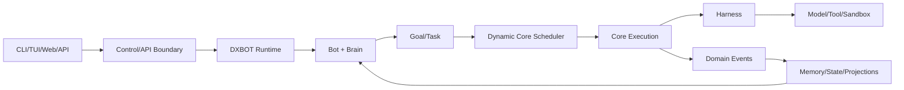

# DXBOT 최상위 기준선

본 문서는 사용자가 제공한 「DXBOT 1차 컨셉 기획안」의 의미를 개발 기준으로 고정한다. 원문과 해석이 충돌하면 원문의 제품 철학을 우선하며, 아래 항목은 별도 승인 없이 완화할 수 없다.

## 1. 목적

DXBOT을 세션 기반 Agent 제품이 아니라 **기억 중심의 지속형 멀티봇 Runtime 및 운영 시스템**으로 구현하기 위한 비협상 제품 원칙을 고정한다.

## 2. 책임 범위

포함:
- Bot, Brain, Memory, Core, Task, Bot Network, Control Plane의 의미
- Session과 Interface의 비소유성
- DeepSeek-inspired Harness와 DXBOT Runtime의 분리
- Rust 중심 구현 및 CLI → TUI → Web UI 전략
- 장기 유지보수성, 재사용성, 메모리·캐시 효율, 동시성 안전성 기준

제외:
- 특정 데이터베이스·LLM 공급자·Web 프레임워크의 영구 고정
- 세부 프로토콜 필드와 소스 코드
- 최종 UI 시각 디자인

## 3. 제품 정의

> DXBOT은 기억을 중심으로 지속적으로 존재하는 AI Bot들이 자신의 실행 능력을 동적으로 분산하고, 서로 협업하며, 하나의 시스템 안에서 통합 관리될 수 있도록 하는 멀티봇 AI Runtime이다.

기본 흐름은 `Bot 존재 → Memory 유지 → 필요 시 실행 → 작업 종료 후에도 Bot 유지`다. Session은 Bot에 접속하는 임시 View이며 Bot의 정체성이나 장기 Memory를 소유하지 않는다.

## 4. 확정 핵심 원칙

1. DXBOT은 일반적인 Session 기반 Agent가 아니다.
2. Bot의 연속성은 `Identity + Memory + Persistent State`로 판단한다.
3. Bot은 요청과 프로세스 수명을 넘어 지속한다.
4. 하나의 Bot에는 하나의 논리적 Brain이 존재한다.
5. Brain은 특정 LLM이 아니며 모델은 교체 가능한 실행 자원이다.
6. Core는 Bot 복제본이나 독립 Sub-Agent가 아니다.
7. Core는 동일 Brain이 병렬 작업 흐름에 참여하기 위한 일시적 실행 단위다.
8. Bot 생성 시 Core 개수를 설정하지 않는다.
9. Runtime은 필요에 따라 Core를 활성화·회수하고 시스템은 최대 동시성만 제한한다.
10. Core는 Identity·장기 Memory·Goal·Permission을 공유하되 Working Context는 분리한다.
11. 공유 상태 변경은 명시적 병합 또는 명령 경로를 거쳐야 한다.
12. Bot은 독립적인 다른 Bot을 호출·위임·협업할 수 있다.
13. Bot 간 관계는 일회성 Parent-Child가 아니라 지속 가능한 Bot Network다.
14. 전체 생태계는 Control Plane에서 관찰·운영하되, Control Plane이 도메인 불변조건을 우회하지 않는다.
15. Harness는 Model·Tool·Skill·Sandbox·Loop 등을 제공하는 실행 기반이며 DXBOT의 제품 정체성과 분리한다.
16. Core Runtime은 Rust를 중심으로 개발하고 UI는 필요에 따라 별도 기술을 사용할 수 있다.
17. 모든 핵심 기능은 UI 없이 Runtime API와 CLI로 검증 가능해야 한다.
18. 인터페이스 우선순위는 CLI → TUI → Web UI다.
19. UI는 Bot 로직을 소유하지 않으며 동일 Runtime 계약을 사용한다.
20. 동일 기능·정책·상태의 중복 구현을 금지한다.
21. 불필요한 복사·할당·상태 중복·무제한 큐를 금지한다.
22. 단기 편의보다 장기 유지보수성·일관성·확장성·동시성 안전성을 우선한다.

## 5. 핵심 구성요소

| 구성요소 | Canonical 책임 | 소유하지 않는 것 |
|---|---|---|
| Bot | Identity, Memory, Goal, Permission, Persistent State | UI 세션, 물리 스레드 |
| Brain | 판단·조정 정책, Context 구성, Task/Core 활용 | 특정 LLM 인스턴스 |
| Core | 단일 작업 흐름의 일시적 실행 임대 | 독립 정체성, 독립 장기 Memory |
| Memory | 장·단기 지식과 경험의 정규화된 기록 | 원본 없는 임의 추론 |
| Task | 실행 가능한 지속 작업과 결과 | Bot 정체성 |
| Harness | 모델·도구·샌드박스·실행 루프 | Bot 생명주기와 조직 의미 |
| Control Plane | 명령·조회·정책·관측의 중앙 표면 | 도메인 저장소 직접 변경 |
| Interface | Runtime에 접근하는 표현 계층 | 도메인 판단과 영속화 |

## 6. 기준 데이터 흐름

Interface 입력은 Command로 변환되고, Runtime은 도메인 불변조건을 검증한 뒤 상태를 변경한다. Harness 결과는 직접 Bot 상태를 수정하지 않고 Execution Result 또는 Memory Proposal로 환원된다.

## 7. 상호작용 원칙

- Session 접속·종료는 Bot 생명주기에 영향을 주지 않는다.
- Core가 공유 Memory를 읽을 때 일관된 Snapshot/Version을 사용한다.
- Core가 장기 Memory를 변경하려면 제안, 검증, 충돌 검사, Commit을 거친다.
- Bot 간 위임은 별도 Task와 Message Envelope를 만들며 상대 Bot의 내부 상태를 직접 공유하지 않는다.
- Control Plane의 모든 변경은 동일 Command Handler를 사용한다.
- Harness의 Session/Event 타입은 Adapter 내부에 격리한다.

## 8. 예외 및 실패 기준

- Runtime 재시작 후 Bot Identity와 확정 Memory가 복원되지 않으면 P0 결함이다.
- Core 실패가 Bot 전체를 비정상 종료시키면 P0 결함이다.
- 부분 성공은 성공/실패/취소/시간초과/출력 유무를 독립 필드로 기록한다.
- 외부 공급자 장애는 재시도 가능성과 멱등성을 판별한 뒤 처리한다.
- 승인되지 않은 Tool·Memory·Bot 간 접근은 기본 거부한다.
- 재생 불가능한 모델 입력 또는 감사 불가능한 민감 작업은 허용하지 않는다.
- 종료는 취소 요청만 보내고 반환하지 않는다. 소유한 하위 작업이 정지·인계·체크포인트되었음을 확인한다.

## 9. 확장성 원칙

- 단일 프로세스/단일 노드에서 먼저 완전한 의미를 검증한다.
- 분산 실행은 동일 Task/Core Lease와 Event 계약을 재사용해야 한다.
- Provider 교체는 Domain 변경 없이 Adapter 추가로 이루어져야 한다.
- Storage 교체는 도메인별 Repository/Unit-of-Work 계약 안에서 수행한다.
- 새로운 Bot 역할은 코드의 enum 확장이 아니라 데이터와 Capability 조합으로 추가한다.

## 10. 구현 우선순위

- **P0:** Persistent Bot, Identity, Event/Storage, Memory 최소 기능, Task, 단일 Core, CLI, Harness 경계, 복구·테스트
- **P1:** Dynamic Core, Multi-Bot, Permission/Sandbox, Observability, TUI, Control API
- **P2:** Web Control Center, 고급 Memory 검색/정리, 원격 Worker, 다중 노드
- **P3:** 자율 Routine, 정책 기반 조직 최적화, 고급 시뮬레이션

## 11. 검증 기준

- 터미널과 Runtime을 재시작해도 동일 BotId와 확정 Memory가 복원된다.
- 두 Core가 동시에 실행되어도 Working Context가 섞이지 않고 공통 Memory 변경은 충돌 규칙을 따른다.
- Core 최대치를 초과하는 요청이 거부가 아니라 대기·감쇠·취소 정책으로 처리된다.
- Bot A가 Bot B에 위임한 작업은 양쪽에서 동일 Correlation으로 추적된다.
- CLI/TUI/Web 중 어느 인터페이스도 DB를 직접 수정하지 않는다.
- Harness Provider를 Fake 또는 다른 구현으로 교체해도 Bot·Task 테스트가 변경되지 않는다.
- 무제한 채널, 무소유 전역 상태, 동일 사실의 복수 Canonical Store가 정적·동적 검사에서 발견되지 않는다.
