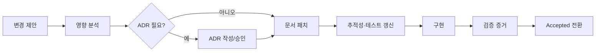

# 문서 거버넌스와 변경 통제

## 1. 목적

상세 기획과 구현이 서로 다른 의미로 분기하지 않도록 문서 소유권, 변경 절차, 승인 기준, 추적성을 정의한다.

## 2. 책임 범위

- 문서 상태와 규범성
- 충돌 해결과 ADR 절차
- 요구사항 ↔ 설계 ↔ 코드 ↔ 테스트 추적
- 외부 참조의 버전 스냅샷
- 폐기·대체 문서 관리

코드 리뷰 방법 자체는 `54-repository-ci-release.md`가 담당한다.

## 3. 구성요소

### 3.1 문서 상태
- `Draft`: 검토 중이며 구현 근거로 사용할 수 있으나 변경 가능성이 높다.
- `Accepted`: 구현과 테스트가 따라야 하는 승인 계약이다.
- `Normative Baseline`: 제품 의미의 최상위 기준이다.
- `Superseded`: 새 문서 또는 ADR로 대체되었으며 링크만 유지한다.
- `Deprecated`: 신규 구현에서 사용하지 않으며 제거 계획이 존재한다.

### 3.2 요구사항 식별자
- 제품 원칙: `PR-xx`
- 기능 요구: `FR-도메인-xxx`
- 비기능 요구: `NFR-분류-xxx`
- 불변조건: `INV-도메인-xxx`
- 수용 테스트: `AT-도메인-xxx`
- ADR: `ADR-xxxx`

### 3.3 변경 세트
의미 변경은 최소한 다음을 한 변경 세트로 묶는다.
1. 기준 또는 도메인 문서
2. 영향받는 API/이벤트 스키마
3. Migration 또는 호환성 판단
4. 수용 테스트와 추적성 표
5. 운영·보안 영향
6. 대체/롤백 계획

## 4. 데이터 흐름 및 상호작용

외부 프로젝트를 참조할 때는 URL만 기록하지 않고 **확인 날짜, 참조 버전/commit, 채택한 개념, 채택하지 않은 개념**을 기록한다.

## 5. 예외상황

- 긴급 보안 수정은 구현을 먼저 병합할 수 있으나 다음 릴리스 후보 생성 전 문서와 ADR을 보완한다.
- 문서와 코드가 충돌하면 코드를 사실로 간주하지 않는다. 동작을 동결하고 기준에 맞게 수정하거나 ADR을 승인한다.
- 외부 API가 예고 없이 변경되면 Adapter를 격리하고 기존 Domain 계약을 유지한다.
- 동일 요구에 두 문서가 서로 다른 Canonical Owner를 지정하면 출시 차단 결함으로 처리한다.

## 6. 확장성

문서 수가 늘어날수록 중앙 목차보다 메타데이터와 ID 기반 링크를 사용한다. 자동 검사기는 다음을 검증한다.
- 깨진 상대 링크
- 중복 document_id
- 존재하지 않는 depends_on
- Superseded 문서의 대체 링크
- 요구사항과 수용 테스트의 미연결 항목
- 버전이 바뀐 스키마 문서와 Migration 부재

## 7. 구현 우선순위

- **P0:** ID 체계, 상태, ADR 템플릿, 추적성 표, 링크 검사
- **P1:** 스키마 차이 검사, 문서-코드 타입 카탈로그
- **P2:** Control Plane에서 실행 중 버전과 문서 버전 비교

## 8. 검증 기준

- 모든 Accepted 도메인 문서가 최소 하나의 소유 crate와 수용 테스트를 가진다.
- 모든 P0 요구가 `61-acceptance-traceability.md`에서 닫힌 경로를 가진다.
- 이벤트·API 스키마 변경 PR에 Migration/호환성 판단이 없으면 CI가 실패한다.
- 대체 문서의 링크 없이 문서를 삭제할 수 없다.
- 외부 참조는 고정된 Snapshot 정보 없이 Normative 근거가 될 수 없다.
