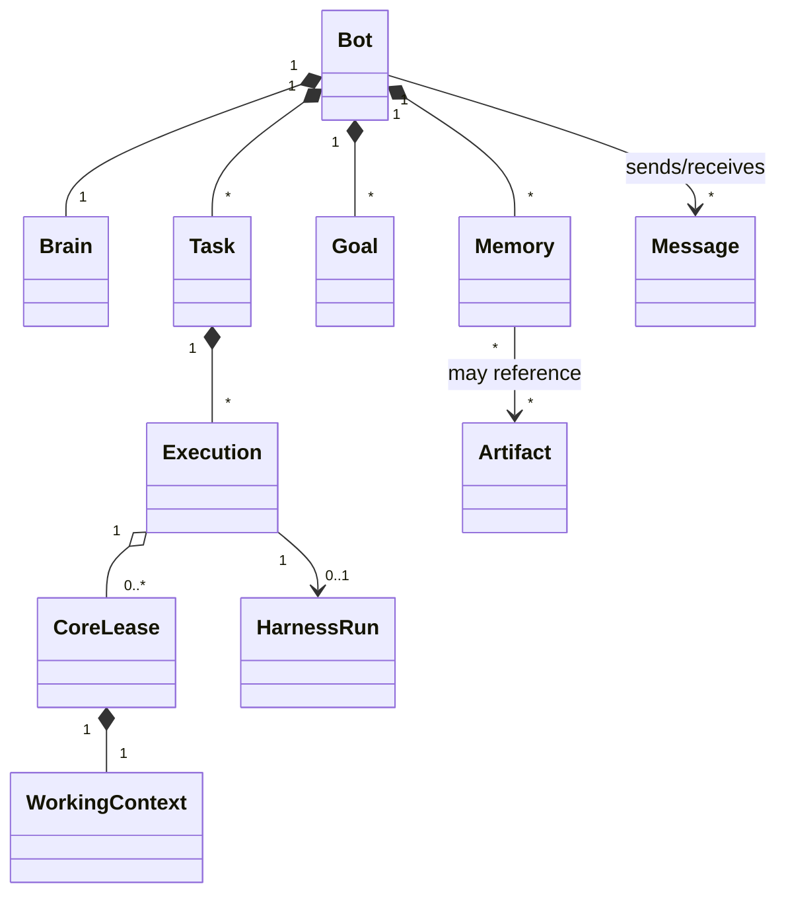

# 용어집과 도메인 모델

## 1. 목적

Bot, Brain, Core, Session, Task처럼 혼동 가능성이 높은 용어를 단일 의미로 고정하고 모든 API·이벤트·UI가 같은 언어를 사용하게 한다.

## 2. 책임 범위

도메인 용어, 식별자, 집합 관계, 수명, 소유권을 정의한다. 저장 형식과 Rust 필드 정의는 각 소유 문서가 담당한다.

## 3. 핵심 용어

| 용어 | 정의 | 수명 | Canonical Owner |
|---|---|---|---|
| Bot | 지속 Identity·Memory·Goal·Permission을 가진 논리 엔티티 | 장기 | Bot Aggregate |
| Identity | Bot의 고유성, 이름, Persona, 역할, 계보, 버전 | Bot과 동일 | Bot |
| Brain | 한 Bot의 판단·조정·Context 정책을 나타내는 논리 중심 | Bot과 동일 | Bot Runtime |
| Memory | 출처와 수명 정책을 가진 정규화된 기억 | 임시~장기 | Memory Store |
| Goal | Bot이 장기간 추구하는 의도와 성공 조건 | 중장기 | Goal Aggregate |
| Task | 실행 가능한 작업 단위와 상태기계 | 완료 후 보존 | Task Aggregate |
| Execution | Task를 수행한 한 번의 시도 | 유한 | Execution Aggregate |
| Core | Brain이 특정 Execution을 위해 취득한 일시적 실행 Lease | 매우 짧음 | Scheduler |
| Working Context | Core 전용 입력·중간 상태·도구 상태 | Core와 동일 | Core Runtime |
| Session | UI/프로토콜의 접속 또는 대화 View | 임시 | Interface/Harness |
| Harness Run | 모델·도구 루프의 한 실행 추적 | 유한 | Harness Adapter |
| Message | Bot 간 의도를 전달하는 내구성 Envelope | 완료 후 보존 | Bot Network |
| Artifact | 파일, 패치, 보고서, 데이터셋 등 큰 결과물의 참조 | 정책 기반 | Artifact Store |
| Command | 상태 변경 의도를 표현하는 요청 | 순간 | Application Layer |
| Domain Event | 이미 발생하여 되돌릴 수 없는 도메인 사실 | 영구/보존정책 | Event Journal |
| Projection | Event에서 재생성 가능한 조회 모델 | 재생성 가능 | Projection Owner |
| Capability | 모델·Tool·Storage·Sandbox 등 교체 가능한 기능 계약 | 배포 단위 | Capability Registry |
| Provider | Capability 계약의 구체 구현 | 배포 단위 | Provider Crate |
| Policy | 허용·제한·우선순위를 결정하는 순수 또는 명시적 상태 함수 | 버전 기반 | Policy Owner |

## 4. 집합 관계

핵심 해석:
- Core는 Bot 아래에 영구 저장되는 하위 Agent가 아니다.
- Execution은 재시도마다 새로 생성된다. Task 상태와 시도 상태를 섞지 않는다.
- Session은 Bot에 연결될 수 있으나 Bot이 Session에 종속되지 않는다.
- Harness Run은 모델이 본 입력과 Tool 실행을 추적하며, Bot Event Journal을 대체하지 않는다.

## 5. 식별자 규칙

- 모든 식별자는 문자열 의미를 내포하지 않는 강타입 Newtype으로 다룬다.
- `BotId`, `TaskId`, `ExecutionId`, `CoreLeaseId`, `MemoryId`, `MessageId`, `ArtifactId`를 상호 변환하지 않는다.
- 외부 Provider ID는 별도 `ExternalRef`로 보관한다.
- 정렬 가능 식별자를 선택할 수 있으나 시간, 보안, 순서 보장을 식별자 자체에 의존하지 않는다.
- 사용자 표시명은 식별자가 아니며 변경 가능하다.

## 6. 상태와 소유권 상호작용

- Bot 상태 변경은 Bot Command Handler가 소유한다.
- Task 상태 변경은 Task State Machine이 소유하고 Scheduler는 Command만 보낸다.
- Core 상태는 Scheduler/Execution Runtime이 소유하며 Bot의 영구 Identity에 기록하지 않는다.
- Memory Canonical Record는 Memory subsystem만 Commit한다.
- UI·Harness·Tool은 Domain Store를 직접 변경하지 않는다.
- Projection은 읽기 최적화를 위해 중복될 수 있으나 원본으로 승격하지 않는다.

## 7. 예외상황

- 동일 표시명의 Bot은 허용하되 BotId로 구분한다.
- Bot 삭제는 즉시 물리 삭제가 아니라 비활성화/보존/삭제 정책 상태로 처리한다.
- Core 프로세스가 남아 있어도 Lease가 만료되면 결과 Commit 권한을 잃는다.
- 재시작 후 복원되지 않는 Working Context는 허용되지만, 확정 Task/Event/Memory는 유실되면 안 된다.
- Harness Session이 fork되어도 Bot은 복제되지 않는다. Bot 복제는 별도 명시적 Command다.

## 8. 확장성

새 용어를 추가할 때 기존 개념과 수명·소유권이 다르면 별도 타입으로 만든다. 단순 편의를 위해 `Agent`, `Worker`, `Core`, `Bot`을 교환 가능하게 사용하지 않는다. 분산 Worker가 추가되어도 Core는 여전히 논리 Lease이며 물리 실행 위치는 별도 `ExecutorNodeId`다.

## 9. 구현 우선순위

- **P0:** ID Newtype, Bot/Task/Execution/Core 구분, 상태 Enum, 소유권 문서
- **P1:** Goal, Artifact, Bot Network 용어
- **P2:** 원격 Worker, Tenant, Organization 용어

## 10. 검증 기준

- 공개 타입과 로그에서 `agent`라는 모호한 단어가 Bot/Core/Harness Agent 중 무엇인지 명시된다.
- Core 종료 후에도 BotId와 TaskId로 결과를 조회할 수 있다.
- Session 삭제 테스트가 Bot과 Memory를 삭제하지 않는다.
- 잘못된 ID 타입을 컴파일 단계에서 전달할 수 없다.
- 모든 Projection이 재생성 경로와 Canonical Source를 문서화한다.
