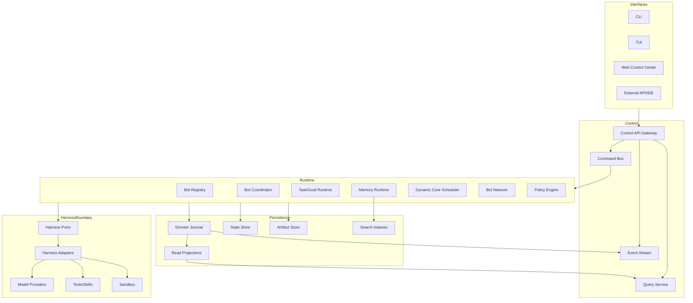

# 전체 시스템 아키텍처

## 1. 목적

DXBOT을 Interface, Control Plane, Bot Runtime, Harness, System Resource로 분리하고 각 레이어의 책임·호출 방향·상태 소유권을 고정한다.

## 2. 책임 범위

포함:
- 프로세스와 논리 컴포넌트
- 동기/비동기 호출 경계
- Command, Event, Query, Stream의 흐름
- 단일 노드 기준 배치와 향후 분산 확장점

제외:
- 개별 데이터 테이블과 API 필드
- UI 화면 세부 설계
- 특정 LLM/Tool 구현

## 3. 아키텍처 원칙

1. Domain은 외부 Framework를 모른다.
2. Application은 Use Case를 조정하지만 도메인 불변조건을 복제하지 않는다.
3. Infrastructure는 Port를 구현하며 Domain 타입을 Provider 타입으로 오염시키지 않는다.
4. Control Plane은 Command와 Query를 제공하지만 저장소를 직접 편집하지 않는다.
5. Harness는 실행을 담당하고 Bot의 정체성과 장기 상태를 소유하지 않는다.
6. UI는 Projection을 표시하고 Command를 제출한다.
7. 모든 비동기 경계는 timeout, cancellation, backpressure, idempotency 의미를 가진다.
8. Canonical Write Path는 하나이며 읽기 최적화 Projection은 재생성 가능하다.

## 4. 논리 구조

## 5. 주요 구성요소와 책임

| 컴포넌트 | 책임 | 금지 |
|---|---|---|
| Runtime Host | 시작·종료, 구성 로드, 컴포넌트 수명 | 도메인 규칙 내장 |
| Bot Registry | Bot 활성 인스턴스 탐색, lazy activation | Bot 상태 직접 변경 |
| Bot Coordinator | Bot별 명령 직렬화, Brain 호출, 상태 복원 | 외부 Provider 타입 노출 |
| Task Runtime | Goal/Task/Execution 상태기계 | Core 수 직접 고정 |
| Core Scheduler | Admission, Lease, fairness, cancellation | Task 성공 의미 결정 |
| Memory Runtime | 기억 Commit, 검색, 승격, 정리 | Harness trace 원본 덮어쓰기 |
| Bot Network | 메시지 Routing, inbox/outbox, correlation | 상대 Bot 내부 상태 접근 |
| Policy Engine | 권한·자원·승인 결정 | Tool 실행 |
| Harness Ports | Model/Tool/Skill/Sandbox/Loop 계약 | Bot 영속성 소유 |
| Projection Builder | Event를 조회 모델로 투영 | Command 처리 |
| Control API | 인증, 유효성 검사, Command/Query 변환 | DB 직접 쓰기 |

## 6. 핵심 데이터 흐름

### 6.1 사용자 Task 제출
1. Interface가 `SubmitTask` Command를 Control API로 보낸다.
2. API는 인증·스키마·idempotency key를 검증한다.
3. Bot Coordinator가 Bot 존재·활성 상태·Permission을 확인한다.
4. Task Runtime이 Task를 생성하고 Domain Event를 한 트랜잭션으로 Commit한다.
5. Outbox/Event Stream이 Scheduler에 준비 상태를 알린다.
6. Scheduler는 자원 Permit을 획득하고 Execution/Core Lease를 만든다.
7. Core는 불변 Brain/Policy/Memory Snapshot으로 Harness를 실행한다.
8. Harness 결과를 Task Result와 Memory Proposal로 변환한다.
9. Task 상태와 결과를 Commit한 뒤 Projection과 Interface Stream이 갱신된다.

### 6.2 Bot 재시작
1. Runtime Host가 저장소 Schema와 Migration 상태를 검증한다.
2. 활성화 대상 Bot의 Snapshot과 이후 Event를 읽는다.
3. Bot Coordinator를 복원하되 외부 Harness 세션은 자동 신뢰하지 않는다.
4. 미완료 Execution은 Lease·체크포인트·Provider 상태에 따라 재개/재시도/실패 판정한다.
5. Projection 지연과 Outbox 미전송 항목을 재처리한다.

### 6.3 Bot 간 위임
1. Source Bot이 Delegate Command를 생성한다.
2. Bot Network가 Message와 Target Task 생성 요청을 동일 상관관계로 기록한다.
3. Target Bot은 Inbox에서 멱등 처리한다.
4. 결과는 별도 Result Message와 Artifact reference로 반환한다.
5. Source Task가 결과를 소비하며 Target 내부 Memory를 직접 읽지 않는다.

## 7. 상호작용 계약

- 동기 호출은 프로세스 내부의 짧고 실패가 즉시 의미 있는 작업에만 사용한다.
- 모델·Tool·검색·Bot 간 호출은 취소 가능한 비동기 작업으로 취급한다.
- Domain Event 발행과 Outbox 기록은 같은 저장 트랜잭션에 속한다.
- Projection 갱신은 지연될 수 있으며 Command 응답은 Commit된 버전과 EventId를 반환한다.
- Query는 `as_of_version` 또는 관측된 Projection watermark를 제공할 수 있다.
- 큰 payload는 Artifact Store에 저장하고 Event/Message에는 참조와 digest만 포함한다.

## 8. 예외상황

| 상황 | 처리 |
|---|---|
| Bot이 비활성/삭제 대기 | 새 Task 거부 또는 정책상 Queue; 명확한 상태 코드 |
| Projection 지연 | Commit 응답은 성공, 조회는 watermark로 지연 표시 |
| Scheduler 과부하 | bounded queue와 admission 결과 제공; 무제한 적재 금지 |
| Harness 응답 중단 | Execution은 timeout/cancel/provider-failure를 분리 기록 |
| Event commit 후 stream 실패 | Outbox 재전송; Domain commit 롤백 금지 |
| 부분 저장 실패 | Unit of Work 전체 롤백 |
| Runtime 종료 | 새 admission 중지 → in-flight quiesce/cancel → checkpoint → flush |
| 잘못된 외부 이벤트 | Adapter quarantine; Domain Event로 직접 변환 금지 |

## 9. 확장성

단일 프로세스에서 컴포넌트를 논리적으로 분리하되 네트워크 RPC를 선도입하지 않는다. 향후 분산 시 다음 경계를 그대로 원격화한다.
- Core Executor Port
- Bot Network Transport
- Projection/Event Stream
- Artifact Store
- Control API

Bot Coordinator의 단일 쓰기 소유권은 샤딩 키 `BotId`로 확장하며, Core Lease는 물리 Worker와 분리한다. 분산 전환 시 Domain Event 순서와 Expected Version 의미는 유지한다.

## 10. 구현 우선순위

- **P0:** Runtime Host, Bot Coordinator, Task, Event/State Store, Harness Port, 단일 Core, CLI
- **P1:** Scheduler 병렬성, Bot Network, Security, Observability, Control API, TUI
- **P2:** Web, 원격 Core Executor, 다중 노드 Projection
- **P3:** 고가용성, 샤딩, 다중 Tenant

## 11. 검증 기준

- Layer 의존성 검사에서 Domain crate가 DB/UI/Harness Provider crate를 참조하지 않는다.
- 동일 Command를 CLI와 테스트 Client에서 실행해 같은 Event를 생성한다.
- Event commit 이후 프로세스를 강제 종료해도 Outbox가 재전송된다.
- Projection을 삭제하고 Journal에서 재구축한 결과가 기준 Snapshot과 동일하다.
- 큰 Artifact가 Message/Event에 중복 직렬화되지 않는다.
- 종료 테스트에서 orphan Core, 미flush Event, 열린 파일/프로세스가 남지 않는다.
