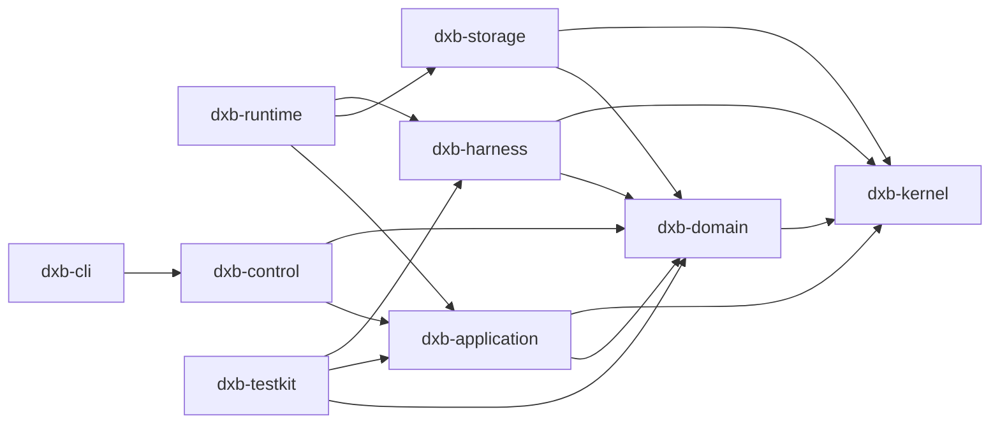

# Rust Workspace와 모듈 경계

## 1. 목적

과도한 crate 분할과 거대한 단일 crate를 모두 피하면서, 컴파일·테스트·재사용·의존성 통제를 지원하는 Rust workspace 구조를 정의한다.

## 2. 책임 범위

- 초기 crate 구성
- crate 간 허용 의존성
- 모듈 소유권과 공개 API
- 공통 코드 배치 원칙
- 분할/병합 기준

## 3. 초기 Workspace 구조

```text
dxb/
├─ Cargo.toml
├─ crates/
│  ├─ dxb-kernel/          # ID, 시간, 오류 분류, 공통 불변 primitive
│  ├─ dxb-domain/          # Bot/Task/Memory/Message 상태기계와 이벤트
│  ├─ dxb-application/     # Use case, command/query orchestration
│  ├─ dxb-storage/         # Storage ports + embedded provider
│  ├─ dxb-harness/         # Harness ports, fake/native/dsh adapters
│  ├─ dxb-runtime/         # Bot coordinator, scheduler, execution host
│  ├─ dxb-control/         # local/HTTP control protocol와 client
│  ├─ dxb-cli/             # reference CLI binary
│  └─ dxb-testkit/         # deterministic clock, fake provider, fixtures
├─ apps/
│  ├─ dxb-daemon/
│  ├─ dxb-tui/             # P1
│  └─ dxb-web/             # P2 또는 별도 저장소
└─ docs/
```

초기에는 기능별로 crate를 무분별하게 쪼개지 않는다. `dxb-domain` 내부를 `bot`, `memory`, `task`, `core`, `botnet` 모듈로 나누고 다음 조건에서만 독립 crate로 분리한다.
- 독립 배포 또는 독립 feature set이 필요하다.
- 의존성 무게를 분리할 수 있다.
- API가 안정되어 별도 팀/릴리스 수명으로 진화한다.
- 분리 후 순환 의존 없이 명확한 Port가 생긴다.

## 4. 허용 의존성 방향



금지:
- `dxb-domain → dxb-storage`
- `dxb-domain → async runtime/framework`
- `dxb-runtime → dxb-cli/TUI/Web`
- Provider crate 간 직접 참조
- `dxb-kernel`이 모든 것의 dumping ground가 되는 것

## 5. 구성요소 책임

### 5.1 `dxb-kernel`
작고 안정적인 값 타입만 소유한다.
- 강타입 ID
- `Clock`, `IdGenerator` Port
- `Revision`, `Sequence`, `Deadline`
- 오류의 상위 분류와 `RetryDisposition`
- bounded size/limit primitive
- digest, content reference

비즈니스 Entity, DB helper, async helper, 문자열 변환 모음은 넣지 않는다.

### 5.2 `dxb-domain`
순수 상태 전이와 불변조건을 소유한다.
- 입력: Command + 현재 상태
- 출력: Domain Event 또는 Domain Error
- 네트워크/DB/시간 전역 접근 금지
- 비결정 값은 명시적 인자로 주입

### 5.3 `dxb-application`
여러 Aggregate와 Port를 조정한다.
- Unit of Work
- idempotency
- authorization context
- command handler
- query facade
- outbox 등록

### 5.4 `dxb-storage`
Domain-specific Store Port와 구현을 함께 두되 모듈로 격리한다. 범용 CRUD Repository를 금지한다. 저장소 최적화가 Domain API에 누출되지 않도록 한다.

### 5.5 `dxb-harness`
- 안정된 DXBOT Harness 계약
- DeepSeek Harness sidecar Adapter
- Native/Fake Provider
- 외부 DTO ↔ 내부 DTO 변환
- conformance suite

### 5.6 `dxb-runtime`
- Bot coordinator 수명
- Core scheduler
- structured concurrency
- background projector/outbox/indexer
- graceful shutdown

### 5.7 `dxb-control`
서버와 Rust client가 같은 schema crate/module을 사용한다. CLI/TUI가 서버 내부 함수를 직접 호출하지 않게 한다.

## 6. 공개 API 규칙

- 기본은 `pub(crate)`이며 외부 소비자가 필요한 최소 표면만 `pub`.
- struct 필드를 공개하지 않고 생성자/명령/조회 DTO를 제공한다.
- 외부에 concrete collection type을 고정하지 않는다.
- trait는 실제 교체 지점과 테스트 지점에만 둔다.
- Domain 내부 다형성은 enum을 우선하고, 런타임 plugin/provider 경계는 trait object를 허용한다.
- generic은 hot path 또는 정적 합성이 이득일 때 사용하고, 공개 API에 불필요한 type parameter를 전파하지 않는다.
- feature flag는 orthogonal capability에만 사용한다. 상호 배타적 조합 폭발을 금지한다.

## 7. 데이터 흐름과 상호작용

`dxb-cli → dxb-control client → control server → dxb-application → dxb-domain → dxb-storage/outbox → dxb-runtime` 흐름을 유지한다. 동일 프로세스 임베디드 모드에서도 Control Client가 in-process transport를 사용할 뿐 계약은 동일하다.

Harness 실행은 `dxb-runtime → dxb-harness port → adapter` 방향이다. Adapter callback은 Domain을 직접 호출하지 않고 typed execution event channel로 반환한다.

## 8. 예외상황

- 순환 의존이 필요해 보이면 타입 소유권이 잘못됐는지 먼저 검토한다.
- test fixture를 production crate에 넣지 않는다.
- 두 crate에서 같은 DTO를 만들지 말고 소유 crate를 정한다.
- compile time 개선만을 위해 의미 없는 crate를 만들지 않는다.
- `unsafe` 최적화는 별도 모듈과 safety contract, Miri/targeted tests, benchmark가 있어야 한다.
- macro는 반복 구문을 줄이되 Domain 의미를 숨기지 않아야 한다.

## 9. 확장성

Provider는 별도 crate로 분리할 수 있다.
- `dxb-harness-dsh`
- `dxb-model-openai-compatible`
- `dxb-storage-postgres`
- `dxb-executor-remote`

그러나 Domain crate는 그대로 유지한다. 원격 Worker 추가 시 protocol DTO는 `dxb-control` 또는 별도 안정 schema crate로 승격한다.

## 10. 구현 우선순위

- **P0:** 8개 초기 crate, dependency deny rules, architecture test
- **P1:** TUI, provider별 crate 분리, remote protocol 준비
- **P2:** Web 별도 workspace/repository 여부 결정, distributed provider

## 11. 검증 기준

- `cargo metadata` 기반 검사에서 금지 의존성이 0건이다.
- 중복 DTO와 중복 Error enum을 정적 검사 또는 리뷰 체크리스트로 탐지한다.
- `dxb-domain` 단위 테스트가 async runtime, DB, network 없이 실행된다.
- 최소 public API와 semver check가 CI에 포함된다.
- clean build와 incremental build 예산을 추적한다.
- feature 조합의 대표 matrix가 컴파일된다.
