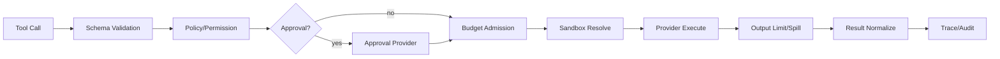

# 공통 계약과 확장 모델

## 1. 목적

Model, Tool, Skill, Sandbox, Storage, Transport 등 교체 가능한 기능을 일관된 방식으로 확장하면서 동일 기능의 중복 구현과 거대한 Plugin API를 방지한다.

## 2. 책임 범위

- Capability seam 정의
- Service Definition / Provider / Consumer 역할
- 등록·해제·의존성·버전 계약
- Hook와 Event의 사용 기준
- 공통 DTO와 Policy 적용 위치

## 3. 확장 단위

각 Capability는 완전한 seam으로 설계한다.

| 역할 | 책임 |
|---|---|
| Definition | 기능 의미, 입력/출력, 오류, 취소, 자원·보안 계약 |
| Provider | 실제 구현과 외부 시스템 변환 |
| Consumer | Runtime 또는 모델이 기능을 사용하는 방식 |
| Policy | 호출 허용, 예산, 승인, 결과 제한 |
| Telemetry | 공통 span/metric/audit 표면 |
| Conformance Test | Provider가 동일 계약을 지키는지 검증 |

한 역할만 존재하는 추상화는 seam이 아니다. 실제 교체 요구가 없으면 내부 함수/모듈로 유지한다.

## 4. 초기 Capability Catalog

- `ModelGateway`: streaming model request/response
- `ToolCatalog` / `ToolExecutor`: 도구 메타데이터와 실행
- `SkillResolver`: Skill 탐색·버전·구성
- `SandboxExecutor`: 격리된 command/process 실행
- `ContextAssembler`: 모델 입력의 결정적 구성
- `ExecutionLoop`: step/turn 운전
- `ArtifactStore`: 대용량 결과 저장/조회
- `MemoryIndex`: lexical/vector/metadata 검색
- `BotTransport`: Bot 간 Message 전달
- `CoreExecutor`: local/remote Core 실행
- `ApprovalProvider`: human/machine 승인
- `SecretResolver`: secret handle을 실제 값으로 해석
- `TelemetrySink`: 표준 관측 이벤트 소비

Storage의 Domain-specific store는 범용 Plugin으로 노출하지 않고 application Port로 유지한다.

## 5. 계약 공통 필드

모든 외부 호출 계약은 가능한 범위에서 다음을 포함한다.
- request/correlation/causation ID
- BotId, TaskId, ExecutionId, CoreLeaseId
- deadline과 cancellation
- idempotency key 또는 비멱등 표시
- policy snapshot/version
- resource budget
- content classification/trust label
- response outcome의 독립 필드
- provider metadata와 raw reference
- schema version

공통 필드를 상속 구조로 강제하지 않고 작은 값 타입을 조합한다.

## 6. 등록과 수명

Provider 등록은 명시적 `CapabilityRegistry`를 통해 이루어진다.
1. manifest와 config schema 검증
2. 필요한 dependency와 capability version 검증
3. resource 초기화
4. provider를 immutable registry snapshot에 등록
5. 신규 Execution부터 snapshot 사용
6. unload 요청 시 신규 할당 중지
7. in-flight quiescence 확인
8. 역순 dispose와 registry 제거

Hot reload 중 진행 중인 Execution의 Provider를 교체하지 않는다. Execution은 시작 시점의 registry/policy snapshot을 유지한다.

## 7. Hook와 Event 선택 기준

- 상태가 살아남아야 하면 Domain Event
- 실행 중 관찰·변환이면 typed Hook
- 단순 notification이면 broadcast Event
- 승인/정책은 명시적 Decision Port
- 핵심 Loop를 바꾸지 않고 붙일 수 있는 기능만 Hook로 구현
- Hook 순서는 안정된 phase와 priority로 정하고 암묵적 등록 순서에 의존하지 않는다
- 하나의 Hook 실패가 후속 observer를 굶기지 않도록 dispatcher가 예외를 격리한다
- 변환 Hook는 before/after 값과 provider를 trace에 남긴다

## 8. Tool Pipeline

단계별로 같은 검증을 중복하지 않는다. 예를 들어 path policy는 `Sandbox/FS Policy`의 단일 소유자가 판단하고 Tool별 코드는 결과를 소비한다.

## 9. 예외상황

- Provider가 계약 외 오류 표현을 반환하면 Adapter에서 정상화한다.
- Hook가 panic/throw 성격의 실패를 내면 해당 Hook를 격리하고 원인을 기록하되 보안 Hook 실패는 fail-closed 한다.
- capability version이 맞지 않으면 시작 단계에서 거부하고 일부 등록 상태를 남기지 않는다.
- unload가 quiescence에 도달하지 못하면 강제 종료 정책과 leaked resource 경고를 별도로 기록한다.
- 같은 기능 Provider가 여러 개면 명시적 selector가 필요하며 "마지막 등록 승리"를 금지한다.
- Provider raw payload는 Domain Event에 그대로 넣지 않고 Artifact 또는 Adapter trace로 보관한다.

## 10. 확장성

동일 contract를 local, sidecar, remote Provider에 적용한다. 원격화 시 deadline, retry, idempotency, partial stream 의미를 유지한다. Plugin SDK 공개는 P0 계약이 안정된 뒤 진행하며, 내부 Rust trait와 외부 wire protocol을 동일시하지 않는다.

## 11. 구현 우선순위

- **P0:** Model, Tool, Sandbox, Context, Artifact, Fake Provider
- **P1:** Skill, Approval, BotTransport, CoreExecutor, dynamic registry
- **P2:** 외부 Plugin SDK, remote provider discovery, signed manifests

## 12. 검증 기준

- 모든 Provider가 공통 conformance suite를 통과한다.
- Provider 교체 시 Domain test와 CLI command 의미가 바뀌지 않는다.
- 등록 실패 후 resource와 registry 항목이 남지 않는다.
- 실행 중 Provider reload가 기존 Execution 결과를 혼합하지 않는다.
- 보안·예산 결정 지점이 Tool별로 중복 구현되지 않았음을 코드 검색과 architecture test로 확인한다.
