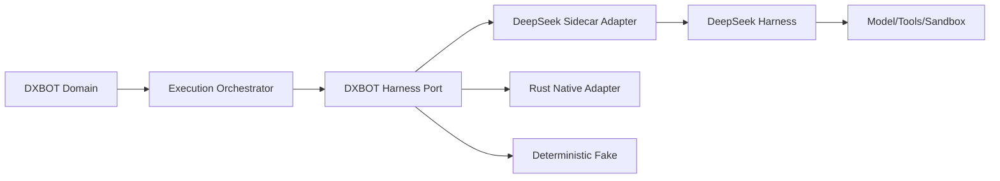

# DeepSeek-inspired Harness 통합

## 1. 목적

DeepSeek Harness의 플러그인 합성, Capability seam, 추적 가능한 실행 로그 철학을 활용하되 DXBOT의 Bot/Memory/Core 의미와 Rust Runtime을 상위 구현 변화로부터 격리한다.

## 2. 외부 기준 스냅샷

2026-08-21 확인 기준:
- DeepSeek Harness는 Model, Tool, Skill, Session, Sandbox, Storage, Loop, Scheduling, UI를 Plugin으로 구성하는 개발자 프리뷰다.
- 공식 문서는 append-only Session Event를 모델 입력 재현, resume/fork/search/replay의 기반으로 설명한다.
- 공식 저장소는 호환성 파괴 변경 가능성을 명시한다.
- 자동화용 ACP 예시는 JSON-RPC stdio 경계를 제공한다.

이 정보는 `64-external-reference-snapshot.md`에 URL과 확인 범위를 기록한다. 상위 프로젝트의 타입·이벤트·디렉터리 구조는 DXBOT의 Normative 계약이 아니다.

## 3. 책임 범위

- Harness Port와 Adapter
- DXBOT Domain Event와 Harness Trace의 관계
- sidecar/native/fake 실행 전략
- upstream version pinning과 compatibility
- model/tool/context/sandbox 매핑

제외:
- DeepSeek Harness 소스의 직접 포크 계획
- 특정 모델 공급자의 세부 API
- Bot Memory를 Harness Session에 저장하는 설계

## 4. 핵심 경계

### 4.1 DXBOT이 소유
- Bot Identity와 Lifecycle
- Memory Canonical Record
- Goal/Task/Execution/Core Lease
- Permission의 제품 의미
- Bot-to-Bot Message
- Domain Journal과 Control Plane
- 자원 예산과 admission

### 4.2 Harness가 소유
- 모델 호출 스트림
- Tool schema와 실행 pipeline
- Skill/Context injection
- Sandbox 실행 Adapter
- turn/step 진행
- 모델이 본 입력과 Tool 결과의 실행 trajectory

### 4.3 공유하지 않는 것
Harness Session ID를 BotId로 사용하지 않는다. Harness fork를 Bot clone으로 해석하지 않는다. Harness의 subagent를 DXBOT Core 또는 독립 Bot으로 자동 매핑하지 않는다.

## 5. Harness Port의 논리 계약

`HarnessRunner`는 다음 의미를 제공해야 한다.
- 입력: immutable `ExecutionRequest`
  - Bot/Task/Execution/Core 식별자
  - Brain Context Snapshot reference
  - 모델·Tool·Skill capability selection
  - policy/resource/deadline/cancellation
  - prior checkpoint 또는 resume token
- 출력: streaming `HarnessEvent`
  - request admitted
  - model delta/message
  - tool call/result
  - approval request/decision
  - checkpoint
  - usage
  - terminal outcome
- 최종: `ExecutionOutcome`
  - completed/failed/cancelled/timed_out/aborted를 독립적으로 표현
  - result artifact references
  - trace reference/digest
  - usage and cost
  - retry classification
  - memory proposals

외부 이벤트는 Adapter DTO이며 Domain Event가 아니다. Orchestrator가 검증·정규화 후 필요한 Domain Event만 만든다.

## 6. 통합 전략

### 단계 A — Deterministic Fake
P0 상태기계와 Scheduler를 외부 모델 없이 개발한다. Fake는 scripted stream, timeout, malformed event, partial result, cancellation race를 재현한다.

### 단계 B — DeepSeek Sidecar Adapter
- 별도 프로세스로 실행
- JSON-RPC stdio/공식 자동화 표면을 우선
- stdout은 protocol frame 전용, 진단은 stderr
- process tree, timeout, shutdown-to-quiescence 관리
- upstream package/version과 protocol fingerprint를 pin
- raw trajectory는 Artifact Store에 보존
- DXBOT secret는 scrubbed environment와 Secret Handle로 제공

### 단계 C — Rust Native Harness
성능·배포·통제 필요가 확인된 capability부터 Rust Native Provider를 추가한다. DeepSeek 구조를 그대로 포팅하지 않고 동일 conformance contract를 충족하게 한다.

### 단계 D — 복수 Harness 선택
Bot/Task policy에 따라 Provider를 선택하되, 하나의 Execution에서는 Provider를 바꾸지 않는다. 실패 시 재시도는 새 Execution attempt로 만든다.

## 7. 실행 데이터 흐름

1. Scheduler가 Core Lease를 발급한다.
2. Brain이 Memory/Goal/Task를 기준으로 Context Plan을 만든다.
3. Context Assembler가 모델 입력을 생성하고 digest를 기록한다.
4. Harness Adapter가 외부 Provider 요청으로 변환한다.
5. Stream 이벤트는 bounded channel로 수신한다.
6. Tool/approval 이벤트는 Policy와 Resource Gateway를 거친다.
7. Adapter trace와 usage는 지속적으로 checkpoint된다.
8. terminal outcome을 정규화한다.
9. Task Runtime이 Task 상태를 Commit한다.
10. Memory Proposal은 별도 Memory write pipeline에서 검토한다.

## 8. Trace와 Domain Journal 분리

| 기록 | Canonical 의미 | 보존 |
|---|---|---|
| Domain Journal | Bot/Task/Core/Message에 발생한 제품 사실 | 장기 |
| Harness Trajectory | 모델이 본 입력, delta, Tool 호출/결과 | 정책 기반 |
| Audit Log | 권한·승인·민감 작업 | 장기/보안 정책 |
| Telemetry | 성능·상태 관측 | 집계/만료 |

Domain Event에는 전체 Prompt/Tool output을 중복 삽입하지 않는다. trace artifact ID, digest, 분류, 핵심 결과만 참조한다.

## 9. 예외상황

- sidecar가 protocol line 외 stdout을 출력하면 protocol violation으로 격리한다.
- terminal event 없이 종료되면 process exit, stderr tail, 마지막 checkpoint를 독립 기록한다.
- streaming 중 Domain 저장 실패 시 수신을 pause/cancel하고 bounded buffer 상한을 넘기지 않는다.
- upstream event가 unknown version이면 raw 보존 후 실행 실패로 정상화한다. 추측 변환을 금지한다.
- resume token이 Provider version과 호환되지 않으면 새 Execution으로 재시도하거나 수동 개입 상태로 전환한다.
- Tool 결과가 매우 크면 inline 상한 이후 Artifact로 spill한다.
- Adapter shutdown은 child kill 요청 후 실제 exit와 pipe drain을 기다린다.

## 10. 확장성

sidecar process pool은 Bot별이 아니라 Provider/config isolation 기준으로 관리한다. 병렬 Core가 같은 sidecar를 공유할 때 protocol multiplexing이 보장되지 않으면 process를 분리한다. 원격 Harness는 동일 wire contract를 사용하되 네트워크 retry가 중복 실행을 만들 수 있으므로 idempotency와 Execution attempt를 분리한다.

## 11. 구현 우선순위

- **P0:** Fake, Harness Port, trace artifact, sidecar lifecycle spike
- **P1:** DeepSeek Adapter conformance, model/tool/sandbox mapping, compatibility matrix
- **P2:** Rust Native capability, multi-provider routing
- **P3:** 외부 Plugin SDK와 원격 Harness marketplace

## 12. 검증 기준

- DeepSeek Adapter를 제거하고 Fake로 교체해도 Bot/Task/Core 수용 테스트가 통과한다.
- upstream 타입 이름이 `dxb-domain` 공개 API에 등장하지 않는다.
- 모델 입력 digest와 trace로 실행을 재구성할 수 있다.
- sidecar crash, malformed JSON, stderr flood, cancellation, timeout 테스트가 resource leak 없이 종료된다.
- upstream upgrade는 compatibility suite와 golden trajectory를 통과해야 한다.
- Harness Session 삭제가 Bot Identity/Memory에 영향을 주지 않는다.
