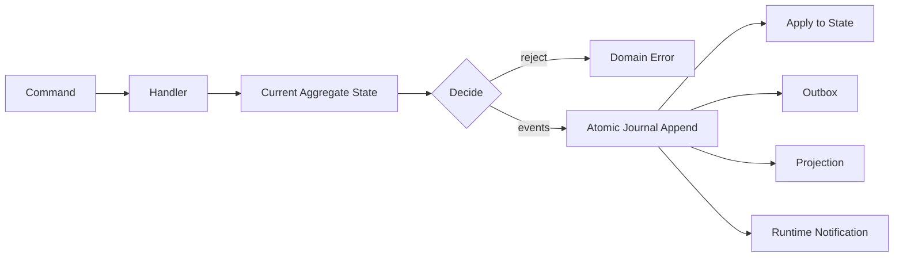

# Command·Event·State·Projection 모델

## 1. 목적

상태 변경의 단일 경로, 감사 가능성, 충돌 검출, 복구, 조회 성능을 함께 확보하기 위해 Command/Event/State/Projection의 역할을 정의한다.

## 2. 책임 범위

- Aggregate와 expected revision
- Domain Event 구조와 버전
- Snapshot과 Projection
- idempotency, outbox, replay
- 이벤트 크기와 민감 데이터 규칙

## 3. 기본 모델

- Command는 의도이며 재시도될 수 있다.
- Domain Event는 과거형 사실이며 immutable이다.
- Aggregate State는 Event fold 또는 Snapshot+Event로 계산한다.
- Projection은 조회용이며 지연·재구축 가능하다.
- Notification은 Event 전달 수단일 뿐 Canonical Source가 아니다.

## 4. Aggregate 경계

초기 Aggregate:
- Bot
- Goal
- Task
- Execution
- Message/Conversation Link
- Memory Record/Revision
- Core Lease
- Runtime Policy Set

하나의 transaction에서 여러 Aggregate를 원자적으로 갱신해야 하는 Use Case는 application Unit of Work가 조정한다. 분산 전환 시 saga/outbox로 확장하되 단일 Aggregate 불변조건은 유지한다.

## 5. Event Envelope

논리적으로 다음 정보를 가진다.
- event_id
- aggregate_type / aggregate_id
- aggregate_revision
- event_type / event_schema_version
- occurred_at / recorded_at
- actor/principal
- correlation_id / causation_id
- command_id / idempotency_key
- payload
- metadata: trace, policy version, source
- sensitivity/retention class
- payload digest

시간은 ordering의 유일 근거가 아니다. Aggregate revision이 순서를 정의한다.

## 6. 결정 및 Commit 규칙

1. Handler가 current revision을 읽는다.
2. Command 권한과 사전조건을 검증한다.
3. 순수 decide 함수가 Event 목록을 생성한다.
4. Store가 `expected_revision`과 함께 append한다.
5. Event, materialized current state, outbox를 한 transaction으로 기록한다.
6. commit 후 비동기 subscriber가 Projection/Index를 갱신한다.
7. 응답은 new revision과 event ids를 포함한다.

충돌 시 자동 merge하지 않는다. 명령의 의미에 따라 reread/redecide 또는 사용자 충돌로 반환한다.

## 7. Snapshot

- Snapshot은 최적화이며 Event를 대체하지 않는다.
- snapshot schema version과 last_event_revision을 가진다.
- 생성 임계값은 Event 수·재생 시간·상태 크기 기반으로 조정한다.
- Snapshot 생성 실패가 Command commit을 막지 않도록 비동기화할 수 있다.
- load 시 digest/invariant를 검증하고 깨지면 Event에서 재구축한다.
- 민감 데이터 암호화/삭제 정책은 Event와 Snapshot 모두에 적용한다.

## 8. Projection

주요 Projection:
- Bot 목록/상태
- Task board/graph
- Active Core
- Memory catalog/search metadata
- Bot Network topology
- Resource usage
- audit timeline

각 Projection은 다음을 선언한다.
- source event set
- projection version
- checkpoint/watermark
- rebuild command
- stale 허용치
- read consistency 옵션
- 개인정보/권한 필터

## 9. 멱등성과 전달 의미

- Command는 `command_id` 또는 scope별 idempotency key로 중복을 판별한다.
- Event append는 aggregate revision과 event id로 중복을 막는다.
- 내부 subscriber와 Bot Message는 at-least-once 전달을 기본으로 한다.
- consumer는 event/message id를 기준으로 멱등 처리한다.
- exactly-once라는 표현은 저장 transaction 내부에만 제한적으로 사용한다.
- 외부 Tool/Model 호출은 본질적으로 중복될 수 있으므로 attempt ID와 side-effect key를 사용한다.

## 10. 예외상황

- Event serialization 실패: transaction 이전에 검증하고 Command를 실패시킨다.
- Commit 성공 후 응답 손실: 동일 idempotency key 재요청 시 기존 결과를 반환한다.
- Unknown event version: Aggregate 복원을 중지하고 quarantine/upgrade-required 상태로 전환한다.
- Projection poison event: source Journal을 막지 않고 projection을 degraded 상태로 표시한다.
- Event payload가 상한 초과: Artifact로 저장하고 reference event를 기록한다.
- Event에 secret가 포함될 위험: schema allowlist와 redaction test로 차단한다.
- clock 역행: sequence/revision으로 처리하며 occurred_at은 사실 정보로만 사용한다.

## 11. 확장성

Journal partition key는 Aggregate ID다. 분산 환경에서는 Aggregate별 단일 writer 또는 consensus store를 사용한다. Projection은 독립 소비자로 확장할 수 있고, Event schema는 upcaster/downcaster가 아니라 명시적 migration과 versioned decoder를 우선한다.

## 12. 구현 우선순위

- **P0:** Bot/Task/Execution Journal, expected revision, idempotency, outbox, basic projection
- **P1:** Memory/Message event, snapshot, rebuild tooling
- **P2:** partitioned consumer, remote projection, archival tier

## 13. 검증 기준

- 동일 Command 100회 재전송이 하나의 의미적 결과만 만든다.
- expected revision race에서 한 writer만 성공하고 다른 writer는 명시적 conflict를 받는다.
- Snapshot 삭제 후 Event replay 결과가 byte/semantic equivalent다.
- Projection을 초기화하고 재구축한 결과가 live projection과 같다.
- Event payload 크기·secret scanner·schema version gate가 CI에 존재한다.
- commit 직후 프로세스 crash 시 outbox가 재처리된다.
