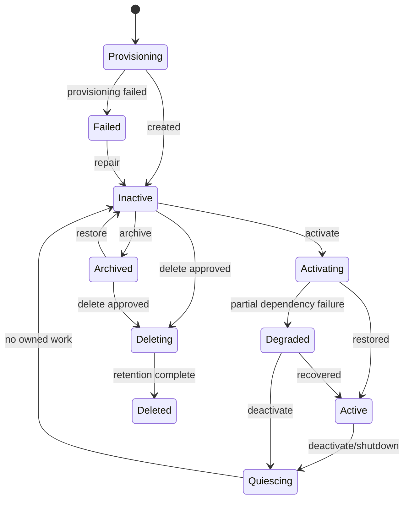

# Bot Identity와 Lifecycle

## 1. 목적

Bot을 세션·프로세스·모델과 독립적으로 지속시키고 생성, 활성화, 정지, 보관, 삭제의 의미를 명확한 상태기계로 구현한다.

## 2. 책임 범위

- Bot Identity와 Persona/Role 구성
- Lifecycle 상태와 전이
- 활성 Runtime 인스턴스와 영구 Bot의 관계
- 복제, 내보내기, 보관, 삭제
- Bot별 단일 쓰기 조정자

Memory 내용, Task 상세 상태, Permission 평가 알고리즘은 각 전용 문서가 소유한다.

## 3. Bot Aggregate 구성

- `BotId`: 변경 불가능한 고유 식별자
- Display Name: 변경 가능한 사용자 표시명
- Identity Revision: Persona, 역할, 설명, 언어/스타일 등 버전
- Lifecycle State
- Brain Policy Reference
- Memory Namespace
- Default Goal Set references
- Capability/Permission Profile references
- Workspace reference
- Resource Policy reference
- Created/Updated metadata
- Parent/Clone provenance(명시적 복제 시)
- Aggregate revision

Bot Aggregate에는 활성 Core 목록이나 대화 Session 목록을 Canonical field로 저장하지 않는다. 이들은 Projection 또는 Runtime 상태다.

## 4. Lifecycle 상태기계

### 상태 의미
- `Provisioning`: ID·namespace·workspace·기본 정책 생성 중
- `Inactive`: 영구 존재하지만 Runtime coordinator가 없음
- `Activating`: Snapshot/Event 복원과 dependency 검증 중
- `Active`: 새 Command/Task를 받을 수 있음
- `Degraded`: 읽기 또는 제한된 작업만 가능
- `Quiescing`: 신규 작업을 막고 하위 Execution을 정리 중
- `Archived`: 장기 보관, 자동 Routine/Task 금지
- `Deleting`: 삭제/익명화/retention 처리 중
- `Deleted`: tombstone만 남거나 정책상 완전 제거
- `Failed`: 생성/복구가 완료되지 않음

## 5. Identity 변경 규칙

- Identity는 immutable revision을 추가하고 current pointer를 이동한다.
- 진행 중 Execution은 시작 시점의 Identity revision을 사용한다.
- 변경은 다음 Execution부터 적용한다.
- BotId는 변경하지 않는다.
- Display Name 중복은 허용한다.
- 역할은 자유 형식 태그/정책 조합이며 시스템 enum으로 고정하지 않는다.
- Persona 변경이 Memory 의미를 소급 변경하지 않는다.
- 보안 관련 profile 변경은 정책에 따라 진행 중 Tool 호출에도 즉시 상한을 강화할 수 있으나, 완화는 새 Execution부터 적용한다.

## 6. 생성 데이터 흐름

1. `CreateBot` Command가 이름, 기본 profile, workspace policy를 받는다.
2. idempotency와 permission을 검증한다.
3. BotId와 namespace를 예약한다.
4. 외부 resource 생성이 필요한 경우 pending resource record를 만든다.
5. `BotProvisioned` Event와 초기 Identity revision을 Commit한다.
6. Projection을 갱신한다.
7. 선택적으로 activate한다.
8. 실패한 외부 resource는 compensation queue에서 정리한다.

생성 중 외부 모델 호출이나 장기 Memory 생성을 요구하지 않는다. 초기 Persona/Goal은 deterministic data로 저장한다.

## 7. 활성화와 비활성화

### 활성화
- storage schema/record 검증
- Bot Snapshot + trailing Events load
- Memory namespace와 policy reference 확인
- Bot Coordinator 생성
- scheduler/network subscription 등록
- background routine 재개 여부 결정
- `BotActivated` Event/Runtime notification

### 비활성화
- 신규 Task admission 중지
- Core/Execution에 quiesce 또는 cancel policy 적용
- pending Memory proposal commit/abort
- outbox flush/checkpoint
- subscriptions 먼저 차단
- child 작업 종료 확인
- coordinator 제거
- `BotDeactivated` 기록

단순히 cancellation token을 발행하고 반환하는 것을 완료로 간주하지 않는다.

## 8. Session 상호작용

- Session 연결은 `Attachment/View`로 기록할 수 있으나 Bot lifecycle을 변경하지 않는다.
- 마지막 Session 종료가 Bot 비활성화를 자동 유발하지 않는다.
- Session별 대화 설정은 Working Context/Interface state이며 Identity가 아니다.
- 여러 Session이 같은 Bot에 동시에 접근할 수 있다.
- 충돌하는 Command는 Bot Aggregate revision과 application policy로 직렬화한다.
- Session 삭제는 Bot Memory와 Task를 삭제하지 않는다.

## 9. 복제와 내보내기

Bot 복제는 명시적 고비용 Command다.
- 새 BotId
- 복제 시점 Identity revision
- 선택된 Memory scope의 copy-on-reference 또는 materialized copy 정책
- Goal/Task 포함 여부
- secret/permission은 기본 제외
- provenance와 source digest
- snapshot consistency

Core fork, Harness Session fork, UI chat duplicate는 Bot 복제가 아니다.

Export에는 versioned manifest, Identity, 선택 Memory/Goal, Artifact references, schema version, checksum이 포함된다. Import는 충돌 없는 새 BotId를 만든다.

## 10. 예외상황

- 동일 Bot activate 경쟁: runtime lock/lease로 하나만 성공
- activation 중 corrupt snapshot: Event replay 후 repair 또는 Failed
- quiescing timeout: 남은 Execution을 orphan/recoverable로 표시하고 정책에 따라 강제 중단
- delete 중 참조 Artifact: reference count/retention에 따라 보존
- workspace 분실: Degraded, 새 Tool write 금지
- Identity revision unknown: activation 중지 및 migration 요구
- Bot Coordinator panic: supervisor가 격리하고 crash loop budget을 적용
- archive 요청 중 active Task: 거부 또는 quiesce 옵션을 명시적으로 선택

## 11. 확장성

단일 노드에서는 in-memory registry가 BotId → coordinator handle을 유지한다. 분산에서는 ownership lease와 routing table로 대체하되 한 Bot Aggregate의 writer는 한 시점에 하나다. 활성 Bot 수가 많아지면 idle coordinator를 eviction하고 필요 시 lazy activation한다.

## 12. 구현 우선순위

- **P0:** create/load/activate/deactivate, identity revisions, single-writer coordinator, CLI
- **P1:** archive/restore, clone/export/import, degraded mode
- **P2:** distributed ownership lease, idle activation cache
- **P3:** 조직 단위 Bot template/lineage 관리

## 13. 검증 기준

- 프로세스 재시작 후 같은 BotId, Identity revision, Memory namespace가 복원된다.
- 마지막 Session 종료 후 Bot이 삭제·초기화되지 않는다.
- 동시에 두 번 activate해 coordinator가 중복 생성되지 않는다.
- deactivate 완료 시 owned Core/process/channel이 0개다.
- Identity 변경 중 실행한 Task가 시작 revision을 유지한다.
- clone이 새 BotId를 만들며 secret/permission을 무단 복제하지 않는다.
