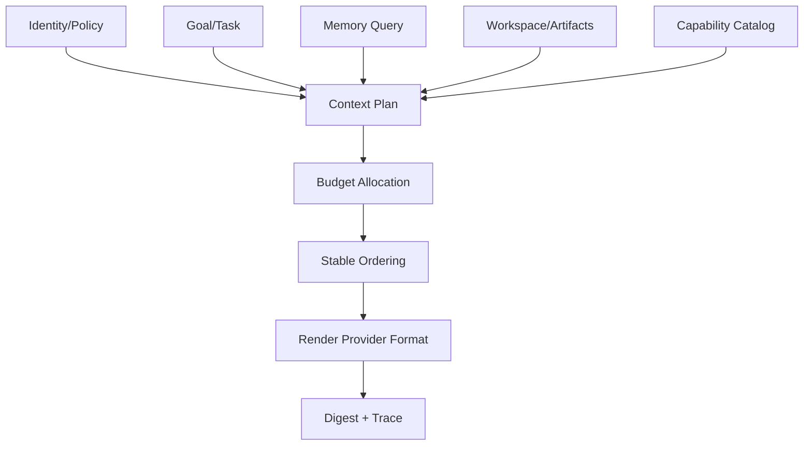

# Brain과 Context 조립

## 1. 목적

Brain을 특정 LLM이 아닌 Bot의 판단·조정 중심으로 정의하고, 여러 Core가 공유 지식은 일관되게 사용하면서 Working Context는 섞이지 않게 한다.

## 2. 책임 범위

- Brain의 논리 책임
- Brain Snapshot과 Working Context
- 모델 선택, Context Plan, Tool/Skill 선택
- 공유/격리 경계
- Context budget, cache 안정성, 재현성

LLM 내부 추론 내용은 저장·모델링 대상이 아니며, Harness 실행 세부는 `13-harness-integration.md`가 담당한다.

## 3. Brain 구성

Brain은 데이터와 정책의 조합이다.
- Identity revision
- Goal/Task view
- Memory query policy
- Context assembly policy
- Model routing policy
- Tool/Skill capability policy
- Core spawn/delegation policy
- Permission/resource policy references
- response/communication policy
- policy bundle version

Brain은 독립 프로세스나 mutable singleton이 아니다. Bot Coordinator가 command 시점에 필요한 immutable `BrainSnapshot`을 만든다.

## 4. 공유 영역과 격리 영역

| 공유(Bot 수준) | 격리(Core 수준) |
|---|---|
| BotId, Identity revision | CoreLeaseId, ExecutionId |
| committed long-term/semantic/episodic/procedural Memory | selected Memory snapshot |
| Goals와 global Task projection | current task slice |
| Permission/Resource policy | temporary variables |
| Capability catalog snapshot | tool execution state |
| Bot-level knowledge | model stream assembly |
| global task status | scratch artifacts |
| communication policy | cancellation/deadline |

Core는 공유 Memory 객체를 직접 수정하지 않고 Memory Proposal을 제출한다.

## 5. Context Plan

Context Plan은 모델 입력을 생성하기 전의 구조화된 선택 결과다.
- system identity/persona sections
- active goal and task instructions
- runtime/policy snapshot
- selected memory IDs/revisions
- prior execution checkpoint
- tool/skill schemas
- bot-to-bot message excerpts
- workspace/artifact references
- token/byte budget allocation
- trust/sensitivity labels
- deterministic ordering and truncation decisions
- content digest

Prompt 문자열만 저장하지 않고 선택 근거와 source references를 보존한다. 최종 model-visible payload는 Harness trace에 재현 가능해야 한다.

## 6. Context 조립 순서

권장 우선순위:
1. 안전/권한/실행 정책
2. Bot Identity와 현재 Task의 성공 조건
3. 최신 확정 user instruction/message
4. 필요한 Goal/Memory
5. Tool/Skill schema
6. 과거 상세 trace/보조 정보

상위 우선순위를 보존하기 위해 하위 항목을 요약/참조화한다.

## 7. Model Routing

Brain은 모델 이름을 Identity에 고정하지 않는다. Routing 입력:
- Task 종류와 복잡도
- context size
- tool/function capability
- latency/cost budget
- data locality/privacy
- provider health
- retry/fallback policy
- user/Bot preference

결정 결과는 `ModelSelection` snapshot으로 기록한다. 실행 중 provider 변경은 새 Execution attempt로 처리한다.

## 8. Core 간 정보 공유

Core가 발견한 결과는 다음 등급으로 전달한다.
1. `Ephemeral Signal`: 같은 Execution coordinator에만 전달
2. `Task Finding`: Task-scoped shared board에 versioned append
3. `Memory Proposal`: 장기 Memory pipeline으로 제출
4. `Artifact`: 큰 결과를 content reference로 공유
5. `Bot Message`: 다른 Bot에 명시적으로 전송

Core끼리 상대의 mutable scratchpad를 읽지 않는다. Task Finding은 append-only와 causal metadata를 사용하고, consumer가 최신 version을 선택한다.

## 9. Context Cache와 메모리 효율

- Identity/Policy/Tool schema의 stable prefix를 revision digest로 캐시한다.
- Core마다 동일 문자열을 복제하지 않고 immutable `Arc`/content reference를 공유한다.
- Provider-specific serialization cache는 adapter가 소유한다.
- cache key는 model/provider/schema/identity/policy/capability revisions를 포함한다.
- 동적 Task/Memory 부분을 stable prefix와 분리해 prefix cache 적중률을 높인다.
- token count와 byte size를 둘 다 제한한다.
- 전체 Memory record를 Core heap에 복제하지 않고 필요한 view만 materialize한다.
- 캐시 최적화는 hit rate, retained bytes, invalidation cost를 계측한다.

## 10. 예외상황

- Memory query timeout: 최소 Identity/Task Context로 degraded 실행 또는 정책상 실패
- Context budget 초과: deterministic priority 기반 축약; 임의 tail truncation 금지
- conflicting Memory: provenance/confidence/recency와 conflict marker를 함께 전달
- Tool schema 과다: Task 관련 capability만 선택
- provider가 role/type을 지원하지 않음: Adapter가 호환 형식으로 정상화하거나 routing 실패
- policy revision 폐기: 새 Execution에서 차단; 진행 중 실행은 강화 정책 적용 가능
- Core가 stale snapshot으로 write 제안: Memory/Task commit 시 expected revision conflict
- prompt injection 가능 content: untrusted label과 instruction/data 경계 유지, 민감 Tool은 별도 승인

## 11. 확장성

Brain Policy는 versioned bundle로 추가하고 Bot별 override는 작은 diff로 저장한다. 새로운 모델/Tool은 Capability Registry에 추가하며 Brain core를 수정하지 않는다. 다중 모델 합의나 verifier는 여러 Execution/Core 조합으로 구현하고 새로운 Brain 복제본을 만들지 않는다.

## 12. 구현 우선순위

- **P0:** BrainSnapshot, ContextPlan, deterministic assembler, Fake model routing
- **P1:** memory retrieval ranking, prefix cache, fallback routing, Task Finding
- **P2:** adaptive model selection, multi-model verification
- **P3:** 학습형 policy 최적화

## 13. 검증 기준

- 동일 snapshot과 inputs가 동일 Context Plan digest를 만든다.
- 두 Core의 temporary context가 상대 trace/prompt에 나타나지 않는다.
- Identity/Tool schema 공통 prefix가 복제되지 않고 참조 공유됨을 heap profile로 확인한다.
- budget 초과 시 필수 정책/Task가 유지된다.
- model provider 교체가 Brain/Memory 타입 변경을 요구하지 않는다.
- stale Memory Proposal이 silent overwrite되지 않는다.
