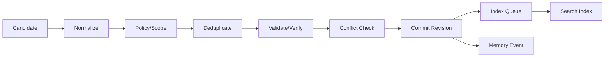

# Memory-Centric Architecture 상세

## 1. 목적

Memory를 채팅 로그 저장소가 아니라 Bot의 지속성과 판단을 구성하는 출처·범위·수명·관계가 있는 지식 시스템으로 구현한다.

## 2. 책임 범위

- Memory 유형과 Canonical Record
- 생성, 검색, 승격, 병합, 정리, 삭제
- Core 동시 쓰기와 충돌
- Context recall
- 인덱스와 캐시
- 민감도·보존·감사

Harness trajectory와 Artifact 본문은 별도 subsystem이 소유하며 Memory는 참조할 수 있다.

## 3. Memory 분류

| 유형 | 의미 | 기본 범위 | 영속성 |
|---|---|---|---|
| Long-term | 장기 유지 사실, 관계, 프로젝트 정보 | Bot/User/Project | 장기 |
| Semantic | 정리된 지식과 개념 | Bot/Shared Knowledge | 장기 |
| Episodic | 언제 무엇을 했고 어떤 결과가 났는지 | Bot/Task | 정책 기반 |
| Procedural | 반복 가능한 절차와 Routine | Bot/Skill | 장기 |
| Working | 현재 Execution/Core 작업 정보 | Core/Task | 임시 |
| Preference | 사용자·Bot 선호 | User/Bot | 장기 |
| Safety/Policy Memory | 금지·승인·운영 제약의 참조 | Bot/Deployment | 정책 버전 |

Working Memory는 장기 Store에 자동 승격되지 않는다. 명시적 Proposal과 정책 검증이 필요하다.

## 4. Canonical Memory Record

논리 필드:
- MemoryId, Revision
- memory class/type
- scope와 owner
- normalized content 또는 Artifact reference
- summary/keywords
- provenance: source type, source ID, author, timestamp
- confidence와 verification state
- sensitivity/trust labels
- validity interval / expires_at
- retention/deletion policy
- relation edges
- supersedes/conflicts_with
- created_by Execution/Core/Bot
- content digest
- index state

Embedding, lexical tokens, ranking score는 Derived이며 Canonical Record가 아니다.

## 5. Memory Write Pipeline

### 단계
1. Candidate는 Core 결과, 사용자 Command, Tool 결과, Bot Message에서 발생한다.
2. Normalize는 형식·언어·단위·source reference를 정리하되 의미를 임의 생성하지 않는다.
3. Policy는 저장 가능 범위, 민감도, 보존 기간, 승인을 결정한다.
4. Deduplicate는 digest/exact/semantic 후보를 찾는다.
5. Validate는 출처와 신뢰도를 평가한다.
6. Conflict Check는 동일 Memory의 expected revision 또는 conflicting fact를 탐지한다.
7. Commit은 immutable revision을 추가한다.
8. Index는 비동기 Derived 작업으로 처리한다.

## 6. Working Memory와 승격

Core Working Memory는 bounded arena 또는 task-local store에 유지한다.
- 최대 byte/item 수
- LRU/priority eviction
- Artifact spill
- Core 종료 시 폐기
- checkpoint 대상은 명시적 항목만
- 장기 승격은 `MemoryProposal`로 제출

Proposal에는 목적, source references, suggested type/scope, confidence, retention, expected related revisions가 포함된다. Brain/Memory policy가 승인하지 않으면 장기 Memory에 기록하지 않는다.

## 7. Recall Pipeline

1. Query intent와 scope 결정
2. permission/trust filter를 먼저 적용
3. exact ID/metadata/relationship 조회
4. lexical/vector 후보 검색
5. canonical records fetch
6. dedup과 conflict grouping
7. relevance/recency/confidence/source diversity 평가
8. context budget에 맞춰 summary/reference 생성
9. selected IDs/revisions와 ranking rationale 기록

검색 인덱스 결과를 그대로 모델에 넣지 않는다. Canonical Record를 재조회하고 정책을 다시 적용한다.

## 8. Memory 관계

기본 relation:
- `supports`
- `contradicts`
- `supersedes`
- `derived_from`
- `about`
- `used_by`
- `produced_by`
- `part_of`
- `similar_to`

관계는 방향·유형·source·revision을 가진다. 임의 graph traversal은 비용 폭발을 막기 위해 depth/node budget을 적용한다.

## 9. 병합과 충돌

- 같은 사실의 표현 차이는 새 revision 또는 alias relation으로 정규화한다.
- 상충 사실은 하나를 덮어쓰지 않고 conflict group을 만든다.
- authoritative source가 확인되면 supersede하되 과거 provenance는 보존한다.
- 두 Core가 같은 revision을 갱신하면 한쪽이 conflict를 받고 재평가한다.
- 자동 merge는 독립 필드이고 의미 충돌이 없음이 증명될 때만 허용한다.
- Memory deletion과 update가 경쟁하면 tombstone이 우선한다.
- stale index가 tombstone을 반환해도 query-time filter가 차단한다.

## 10. 정리·압축·망각

정리는 단순 삭제가 아니다.
- 만료
- 중복 병합
- 상세 Episode를 Summary + Artifact reference로 압축
- 낮은 가치/미사용 항목 cold tier 이동
- 정책상 삭제/tombstone
- user-requested forget
- 관계 고아 정리

Compaction은 원본 digest와 provenance chain을 유지한다. 요약 품질이 검증되지 않으면 원본을 제거하지 않는다. 삭제는 Canonical Store, Index, Cache, Backup retention을 각각 추적한다.

## 11. 메모리·캐시 효율

- 본문은 immutable blob/reference로 공유한다.
- 짧은 metadata와 hot ranking 필드만 hot table에 둔다.
- embedding은 별도 packed storage/index에 보관한다.
- 동일 Context에 반복 선택되는 Memory summary를 revision digest로 캐시한다.
- relation adjacency는 필요한 방향만 materialize한다.
- prefetch는 query plan 기반으로 제한하고 전체 graph를 로드하지 않는다.
- 문자열 복사 대신 borrowed view/Arc<str>/Bytes를 적절히 사용하되 retained allocation을 계측한다.
- vector dimension/precision은 품질·메모리 benchmark 후 결정한다.

## 12. 예외상황

- Index unavailable: metadata/exact 검색으로 degraded
- Embedding provider 실패: commit은 성공, index pending 상태
- source Artifact 삭제: Memory는 dangling source로 표시하고 신뢰도 재평가
- malformed candidate: reject + trace, raw untrusted content를 장기 저장하지 않음
- 매우 큰 memory: Artifact reference와 bounded summary만 기록
- 민감 Memory 접근: permission, purpose, audit 필요
- 사용자 정정: 기존 사실 삭제보다 corrected revision + supersedes를 기본
- 시계열 사실: validity interval을 사용하고 "최신" 단일 필드로 덮어쓰지 않음

## 13. 확장성

초기 local lexical/metadata search에서 vector 또는 external index로 확장한다. Bot 간 Memory 공유는 physical table 공유가 아니라 명시적 scope, ACL, provenance로 구현한다. 글로벌 Knowledge Base가 추가되어도 Bot private Memory와 별도 namespace/정책을 유지한다.

## 14. 구현 우선순위

- **P0:** record/revision, provenance, working memory, exact/metadata recall, proposal/commit, deletion
- **P1:** lexical/vector index, relation graph, compaction, conflict UI
- **P2:** shared knowledge scope, distributed index, tiering
- **P3:** 자동 가치 평가와 학습형 recall

## 15. 검증 기준

- Runtime 재시작 후 MemoryId/revision/content digest가 동일하다.
- Working Memory가 Core 종료 후 자동 장기 저장되지 않는다.
- concurrent revision update가 silent overwrite를 만들지 않는다.
- Index 삭제 후 rebuild가 canonical record와 일치한다.
- tombstone Memory가 stale cache/index에서도 반환되지 않는다.
- 100k 항목에서 recall latency/RSS가 `51-performance-memory-cache.md` 예산을 만족한다.
- 모든 recalled item에 provenance와 선택 revision이 존재한다.
