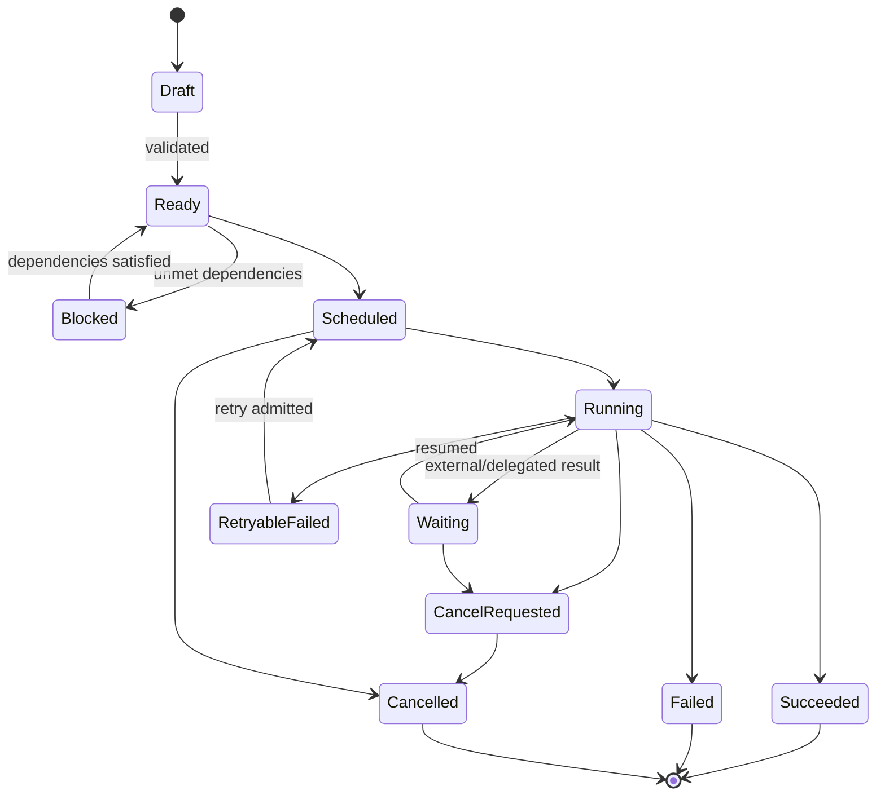

# Goal·Task·Execution 모델

## 1. 목적

장기 의도(Goal), 실행 가능한 작업(Task), 실제 시도(Execution)를 분리해 재시도·병렬화·위임·복구의 의미를 일관되게 만든다.

## 2. 책임 범위

- Goal/Task/Execution 상태기계
- Task DAG와 dependency
- 결과, Artifact, retry
- Core Scheduler와 상호작용
- 멱등성, 취소, deadline

## 3. 개념 구분

| 개념 | 질문 | 변경 빈도 |
|---|---|---|
| Goal | 무엇을 지속적으로 달성하려는가? | 낮음 |
| Task | 무엇을 실행 가능한 단위로 해야 하는가? | 중간 |
| Execution | 이 Task를 이번에 어떻게 시도했는가? | 높음 |
| Core Lease | 어떤 실행 슬롯이 이 시도를 수행하는가? | 매우 높음 |
| Result | 어떤 검증 가능한 산출이 나왔는가? | 실행 종료 시 |

Task 실패가 Goal 실패를 자동 의미하지 않는다. Execution 실패가 Task 실패를 자동 의미하지 않으며 retry policy가 판정한다.

## 4. Goal 상태

`Draft → Active → Paused → Achieved | Abandoned | Archived`

Goal 구성:
- owner Bot
- intent와 success criteria
- priority
- policy/constraints
- linked Tasks
- progress projection
- review cadence
- validity/retention
- revision

Goal은 모델이 임의로 완료 처리하지 않는다. success evaluator 또는 사용자/정책 승인으로 전이한다.

## 5. Task 상태기계

Task terminal 상태는 `Succeeded`, `Failed`, `Cancelled`. `TimedOut`은 Execution outcome이며 Task policy가 최종 상태를 결정한다.

## 6. Task 구성

- TaskId, owner BotId
- optional GoalId/parent TaskId
- specification와 acceptance criteria
- input Artifact/Memory references
- priority, deadline, not-before
- resource/cost budget
- capability requirements
- dependency edges
- delegation policy
- retry policy
- current status/revision
- result summary/artifacts
- created_by/correlation/causation

Task specification은 실행 중 변경하지 않는다. 변경은 새 revision이며 실행 중 시도는 시작 revision을 유지한다.

## 7. Task Graph

edge type:
- `requires`: 선행 성공 필요
- `blocks`: 역관계 projection
- `produces_for`: 결과 공급
- `subtask_of`: 구조 분해
- `delegated_to`: 다른 Bot Task 연결
- `verifies`: 검증 Task
- `supersedes`: 대체 Task

Graph는 cycle-free가 필요한 edge(`requires`, `subtask_of`)와 cycle을 허용할 수 있는 relation을 구분한다. Cycle 검사에 node/depth budget을 둔다.

## 8. Execution 상태와 Outcome

Execution은 Task revision, attempt number, selected model/harness, Brain/Policy snapshot, Core leases, trace, usage를 가진다.

Outcome은 서로 독립적인 사실을 보존한다.
- terminal kind
- provider finish reason
- exit code/signal
- timed_out
- cancellation requested/observed
- partial output available
- result validated
- retry disposition
- cost/usage
- trace/artifact references

`timeout이면서 exit 0` 같은 조합을 단일 status로 덮지 않는다.

## 9. 실행 흐름

1. Task가 Ready가 되면 scheduler feed에 등록한다.
2. Scheduler가 global/Bot/provider budget을 확인한다.
3. Execution attempt를 생성한다.
4. Core Lease를 하나 이상 발급한다.
5. Brain Context Snapshot과 Task slice를 Core에 전달한다.
6. Core가 Harness 실행과 Tool 호출을 수행한다.
7. 중간 finding/checkpoint를 append한다.
8. 결과를 validator가 acceptance criteria와 비교한다.
9. Execution outcome을 Commit한다.
10. Task policy가 success/retry/fail/wait를 결정한다.
11. Goal/Projection을 갱신한다.

## 10. Retry와 멱등성

- retry는 동일 Execution 재사용이 아니라 새 attempt다.
- 비멱등 Tool이 실행됐으면 side-effect ledger를 확인한다.
- retry budget은 횟수뿐 아니라 cost/time/provider error class를 포함한다.
- exponential backoff는 bounded하고 deadline을 넘지 않는다.
- validation failure와 provider transport failure를 구분한다.
- 사용자 취소는 신규 retry를 금지한다.
- idempotency key가 같은 SubmitTask는 기존 Task를 반환한다.

## 11. 취소와 Deadline

- Task cancellation은 의도이며 각 Execution/Core에 전파된다.
- Core는 cancellation safe point에서 checkpoint/cleanup한다.
- Tool 취소가 불가능하면 상태를 `CancelRequested`로 유지하고 실제 종료를 추적한다.
- deadline은 admission, queue, execution, external call에 남은 시간을 전달한다.
- cancellation과 completion race는 Event ordering으로 하나의 terminal Task 결정만 허용한다.
- partial result 보존 여부를 Task policy가 정한다.

## 12. 결과 검증

Result는 단순 모델 답변이 아니다.
- structured summary
- produced Artifacts
- evidence/source references
- acceptance check results
- warnings/limitations
- confidence
- trace reference
- memory proposals
- downstream Task signals

Verifier는 deterministic validator, Tool-based test, 별도 Review Core/Bot, human approval을 조합할 수 있다.

## 13. 예외상황

- dependency Task 삭제/보관: dependent Task를 Blocked+reason으로 유지
- graph cycle 요청: Command reject
- worker crash: Lease 만료 후 recover/retry
- result commit 전에 side effect 성공: side-effect ledger와 reconciliation
- duplicate terminal event: revision/idempotency로 무시하고 audit
- deadline 지난 queued Task: 실행하지 않고 expired policy 적용
- validation service unavailable: Waiting 또는 retryable, 임의 success 금지
- delegated Bot 미응답: timeout/cancel/escalate policy

## 14. 확장성

Task DAG는 Bot 내부와 Bot 간 link를 동일 ID graph로 표현하되 소유권은 각 Bot에 남긴다. 원격 Worker에서도 Execution/Core Lease 계약을 재사용한다. 대규모 graph 조회는 Projection에서 처리하고 Aggregate load에 전체 graph를 넣지 않는다.

## 15. 구현 우선순위

- **P0:** Task/Execution 상태기계, 단일 Core, retry/cancel, result/artifact
- **P1:** DAG, verification, delegated task, checkpoint
- **P2:** distributed execution, advanced planner, large graph projection
- **P3:** 자율 Goal decomposition/optimization

## 16. 검증 기준

- Execution 3회 retry가 하나의 Task와 세 개의 독립 attempt로 보인다.
- 취소/완료 race에서 Task terminal Event가 하나만 Commit된다.
- requires cycle을 생성할 수 없다.
- non-idempotent Tool 후 crash를 reconciliation할 수 있다.
- Task revision 변경이 진행 중 Execution input을 바꾸지 않는다.
- Result가 acceptance evidence 없이 성공 처리되지 않도록 정책 테스트가 존재한다.
