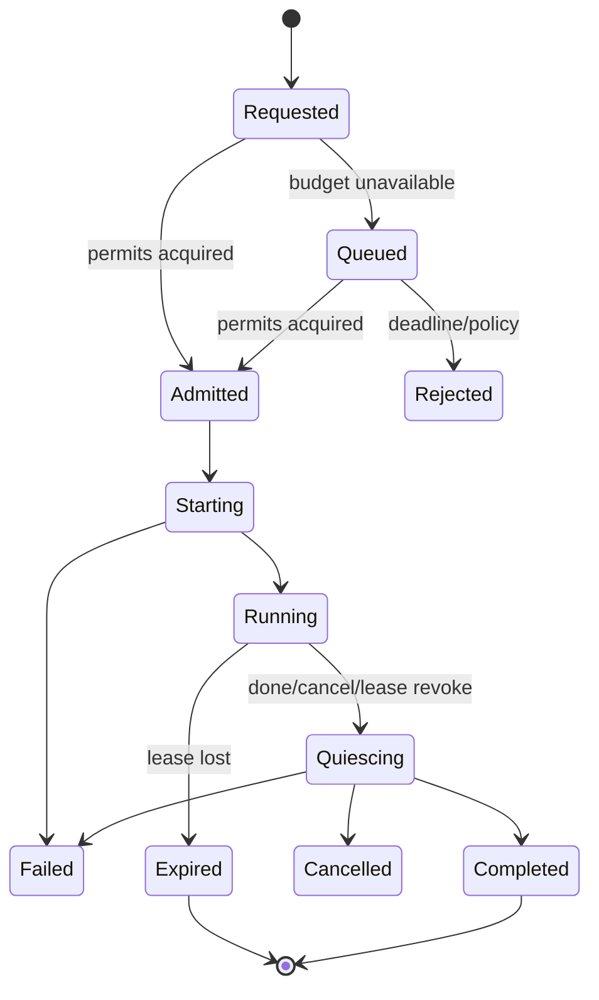
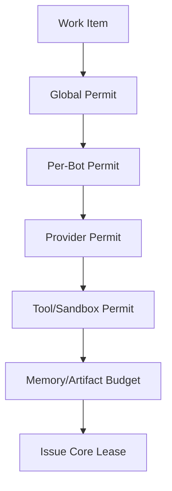

# Dynamic Core Scheduler

## 1. 목적

Bot 생성 시 Core 수를 고정하지 않고 작업의 병렬성, 자원·비용·충돌 위험에 따라 Core를 동적으로 발급·회수하며 시스템 안정성을 보장한다.

## 2. 책임 범위

- Core의 Lease 의미와 상태
- admission, fairness, 병렬화 판단
- global/Bot/provider/tool 제한
- 결과 수집과 merge
- cancellation, lease expiry, backpressure

Task 성공 판정과 Bot Identity는 Scheduler가 소유하지 않는다.

## 3. Core 정의

Core는 다음 속성을 가진 일시적 실행 Lease다.
- CoreLeaseId
- BotId, TaskId, ExecutionId
- task slice/work item
- Brain/Identity/Policy/Memory snapshot revisions
- capability/resource grants
- priority/deadline
- admitted_at/start/expiry
- executor location
- cancellation token
- output/checkpoint channel
- state/revision

Core는 장기 Memory, 독립 Persona, 독립 Goal을 갖지 않는다.

## 4. 상태기계

Lease가 terminal이면 늦게 도착한 결과는 Commit 권한이 없으며 orphan trace로만 보존할 수 있다.

## 5. 병렬화 판단

Scheduler는 단순히 빈 슬롯이 있다고 Core를 늘리지 않는다. 다음을 평가한다.
- Task DAG상 독립 work item 수
- 예상 병렬 이득과 분할/병합 overhead
- 공유 Memory/Artifact write conflict 위험
- 모델·Tool provider 동시성/요율 제한
- global/Bot 예산과 우선순위
- deadline과 queue delay
- context 생성 비용
- verifier/replication 필요
- 과거 유사 Task의 관측 통계

초기 P0는 명시적으로 분할된 work item만 병렬 실행한다. 자동 분해는 P1 이후이며 항상 최대 fan-out과 depth를 제한한다.

## 6. Admission 계층

Permit은 정해진 순서로 획득하거나 중앙 admission transaction으로 교착을 피한다. 실패 시 이미 획득한 permit을 즉시 반환한다.

## 7. Queue와 Fairness

- 모든 queue는 bounded
- priority는 user/system class + Task priority + aging으로 계산
- 한 Bot이 global slot을 독점하지 않게 per-Bot cap과 fair share 적용
- low priority starvation을 막기 위해 aging
- deadline 임박 작업이 무조건 비용/보안을 우회하지 않음
- provider별 rate limit은 token bucket/leaky bucket 등 명시적 정책으로 구현
- queue overflow 시 reject/replace/coalesce 중 정책을 반환
- 동일 Task의 중복 work item은 coalesce 가능하나 side effect 여부를 확인

P0 기본은 단순 deterministic priority queue + per-Bot round-robin이며 복잡한 알고리즘은 계측 후 도입한다.

## 8. Core 실행 흐름

1. Task Runtime이 `CoreWorkRequest`를 제출한다.
2. Scheduler가 Task/Execution revision과 deadline을 검증한다.
3. admission permit을 획득한다.
4. Core Lease Event와 state를 Commit한다.
5. local/remote Core Executor에 immutable request를 전달한다.
6. heartbeat/checkpoint/usage를 수신한다.
7. partial finding을 Task-scoped board에 append한다.
8. 완료 시 result를 검증하고 Lease terminal 전환한다.
9. permit과 memory buffers를 회수한다.
10. Execution coordinator가 여러 Core 결과를 merge/verify한다.

## 9. 결과 병합

Core output은 직접 공유 state를 덮지 않는다.
- immutable Result Fragment
- source Core/Task slice
- input snapshot revisions
- produced Artifact references
- write set/Memory Proposals
- validation evidence
- conflicts

Merge 전략:
- disjoint keyed results: deterministic union
- ordered result: explicit stable sort key
- same entity update: expected revision conflict
- natural language synthesis: 별도 merge Core 또는 Brain step
- verifier disagreement: conflict state/Review Task

## 10. 취소·Lease·Heartbeat

- cancellation은 Task → Execution → Core로 전파
- global emergency stop은 신규 admission을 먼저 중지
- local Core도 Lease expiry를 사용해 future remote semantics를 검증
- heartbeat interval과 expiry는 provider/task 특성에 맞는 bounded policy
- network partition에서 remote Core 결과는 lease token/fencing value를 검증
- quiesce는 child tool/process 종료와 channel drain을 기다림
- orphan execution sweeper가 만료 Lease와 dangling permit을 정리

## 11. 메모리 효율

- Core당 전체 Brain/Memory clone 금지
- immutable snapshot reference 공유
- task-local bump arena/pooled buffers는 benchmark 후 적용
- stream channel capacity를 payload 크기와 함께 제한
- large result는 Artifact spill
- scheduler queue item은 compact metadata만 보유
- completed Core 상세는 hot memory에서 즉시 제거하고 Projection/Store로 조회
- permit 객체가 heavyweight state를 보유하지 않음

## 12. 예외상황

- permit 획득 중 cancellation: 모든 부분 permit 반환
- Core 시작 전 deadline: Lease를 실행하지 않고 expired/rejected 처리
- executor accept 후 ack 손실: lease/idempotency로 중복 start 방지
- heartbeat 지연이나 GC/부하: 단일 miss가 아니라 정책 threshold로 판정
- result 도착과 lease expiry race: fencing token으로 terminal 권한 결정
- provider rate limit 변경: 신규 admission에 즉시 적용, 진행 중 호출은 별도 정책
- Scheduler restart: persisted requested/lease state를 reconcile
- Task 취소 후 late Tool side effect: side-effect ledger와 incident 표시

## 13. 확장성

local executor에서 remote worker pool로 확장한다. Scheduler는 물리 CPU core 수와 DXBOT Core를 동일시하지 않는다. Worker selection은 capability, data locality, sandbox, load를 고려하며 Bot/Core 의미는 유지한다. 계층 Scheduler를 도입하더라도 global policy와 per-Bot fairness를 중앙에서 검증한다.

## 14. 구현 우선순위

- **P0:** 단일/명시 병렬 Core, bounded queue, global/per-Bot permits, cancellation
- **P1:** provider/tool permits, adaptive fan-out, merge/verifier, lease reconciliation
- **P2:** remote executor, fencing, locality-aware placement
- **P3:** 관측 기반 자동 scheduler tuning

## 15. 검증 기준

- Bot 생성 API에 core count 필드가 없다.
- global/per-Bot 최대치를 넘어 실행되는 Core가 없다.
- 1개 Bot의 flood가 다른 Bot을 무기한 starvation시키지 않는다.
- cancellation/timeout/crash 후 permit leak가 0이다.
- stale Lease의 late result가 Task/Memory를 Commit하지 못한다.
- 병렬 실행 결과가 deterministic merge 규칙을 따른다.
- Core 수 증가가 overhead보다 이득이 없을 때 fan-out하지 않는 benchmark gate가 있다.
