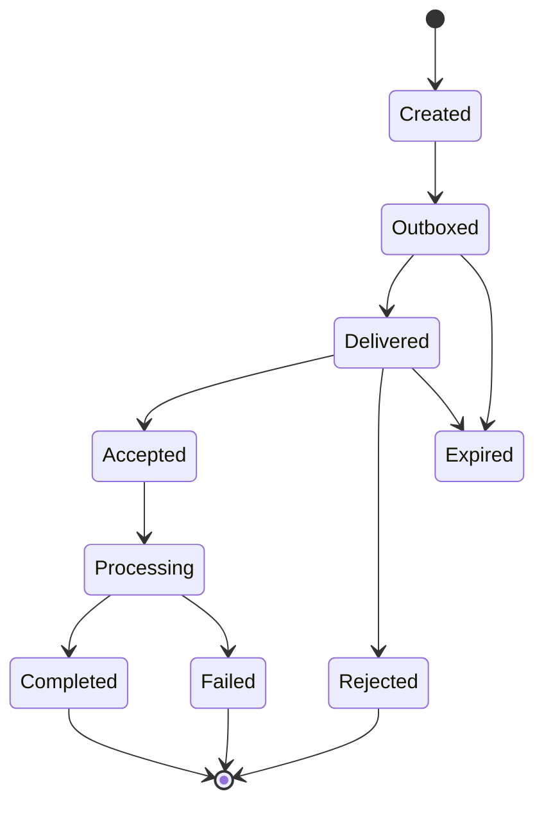

# Multi-Bot Network와 협업

## 1. 목적

독립 Identity와 Memory를 가진 Bot들이 요청, 메시지, 위임, 결과, 알림, 협업을 내구성 있고 추적 가능하게 수행하도록 한다.

## 2. 책임 범위

- Message Envelope와 전달 의미
- capability discovery와 authorization
- request/reply/delegate/notify/collaborate
- durable inbox/outbox
- cycle, timeout, failure, partial result
- 동일 Runtime 및 원격 Transport

상대 Bot의 Task 내부 실행과 Memory 구조는 본 문서가 소유하지 않는다.

## 3. 상호작용 유형

| 유형 | 응답 기대 | 내구성 | 용도 |
|---|---|---|---|
| Message | 선택 | 내구성 | 일반 정보 전달 |
| Ask | 예 | 내구성 | 질문과 답변 |
| Request | 예 | 내구성 | 특정 결과 요청 |
| Delegate | Task 결과 | 내구성 | 책임 있는 작업 위임 |
| Notify | 아니오 | 내구성/정책 | 상태·사건 통지 |
| Result | correlation 대상 | 내구성 | 결과 반환 |
| Collaborate | 복수 메시지/Task | 내구성 | 공동 작업 채널 |
| Signal | 아니오 | 임시 | 동일 Runtime의 비중요 wake-up |

Domain 의미가 있는 교환은 Signal이 아니라 Message로 기록한다.

## 4. Message Envelope

- MessageId
- schema version / message type
- source BotId / target BotId 또는 group
- sender principal
- correlation / causation / conversation ID
- linked source/target Task IDs
- idempotency key
- created/expires/deadline
- hop count / route trace
- priority
- permission delegation token/reference
- payload summary
- Artifact/Memory references
- trust/sensitivity labels
- reply policy
- delivery/processing status

큰 payload와 전체 Memory를 Message에 복사하지 않는다.

## 5. 전달 상태기계

Transport delivery와 target processing을 구분한다. `Delivered`는 작업 성공이 아니다.

## 6. 위임 흐름

1. Source Bot이 Task를 분해하고 delegate policy를 평가한다.
2. target capability/permission/availability를 조회한다.
3. Source Task에 delegation link를 Commit한다.
4. Message와 outbox를 같은 transaction에 기록한다.
5. Target inbox가 MessageId로 dedup한다.
6. Target Bot이 별도 Task를 생성하거나 거부한다.
7. acceptance/rejection reply를 보낸다.
8. Target Task 결과와 Artifact를 Result Message로 반환한다.
9. Source Bot이 결과를 검증·통합한다.
10. 양쪽 Task/Message timeline이 같은 correlation으로 조회된다.

위임은 source Task의 소유권 이전이 아니다. Target Bot은 자신의 Task와 Memory를 소유한다.

## 7. Capability Discovery

Bot Profile은 제공 가능한 capability를 선언할 수 있다.
- role/tag
- supported task classes
- required input/output schema
- security/data locality
- cost/latency class
- current availability projection
- version
- trust relationship

Discovery 결과는 hint이며 최종 authorization과 admission은 target이 다시 판단한다. UI 표시 정보를 보안 결정으로 사용하지 않는다.

## 8. 권한 위임

- source의 권한이 target으로 자동 전파되지 않는다.
- delegation token은 최소 scope, target, task, expiry, capability를 명시한다.
- target은 자기 policy와 token의 교집합만 허용한다.
- secret는 Message에 넣지 않고 target-specific handle 또는 broker를 사용한다.
- 민감 Memory 공유는 item-level scope와 purpose를 기록한다.
- target이 다른 Bot에 재위임할 수 있는지 명시한다.

## 9. Cycle과 폭발 방지

- hop count와 delegation depth 상한
- visited Bot/Task chain
- 같은 semantic request의 idempotency/coalescing
- fan-out budget
- cost/token budget 전파
- self-delegation 금지 또는 명시적 local subtask 변환
- A→B→A cycle 탐지
- collaboration room의 participant와 message rate 상한

Cycle 탐지는 단순 BotId뿐 아니라 Task lineage/correlation을 함께 본다.

## 10. 실패와 부분 성공

- target unavailable: queue/alternate target/fail 정책
- target reject: reason과 capability mismatch 반환
- reply timeout: source가 cancel/escalate/retry 결정
- duplicate result: MessageId/TaskId로 dedup
- target succeeded but reply lost: source query/reconciliation
- source cancelled after target start: cancellation request를 보내되 target policy가 side effect 처리
- partial artifact: completeness/validation metadata 필수
- target Bot archived/deleted: routing 단계에서 거부
- schema incompatible: quarantine와 negotiation 실패

## 11. 메모리 상호작용

- Bot 간 Message가 자동으로 상대 Long-term Memory가 되지 않는다.
- 받은 정보는 untrusted candidate로 취급하고 Memory Proposal pipeline을 거친다.
- shared knowledge scope가 있더라도 private Memory pointer를 직접 노출하지 않는다.
- 결과 provenance에는 source Bot, target Task, trace digest가 포함된다.
- source Bot 정정/삭제가 target Memory에 미치는 영향은 relation/event로 통지하며 자동 소급 삭제 여부는 policy가 결정한다.

## 12. 확장성

동일 프로세스에서는 durable DB outbox와 in-memory wake-up을 조합한다. 원격 Runtime에서는 Transport Adapter를 교체하되 Envelope와 at-least-once 의미를 유지한다. Group/organization routing은 P2에서 추가하며 broadcast는 명시적 subscriber set과 rate limit을 가진다.

## 13. 구현 우선순위

- **P1:** direct Message, Ask/Result, Delegate, inbox/outbox, correlation, cycle limit
- **P2:** remote transport, groups, capability registry, trust federation
- **P3:** 조직 정책, 시장형 routing, adaptive collaboration

## 14. 검증 기준

- 중복 전달 100회에도 target Task가 하나만 생성된다.
- Source/Target timeline이 correlation으로 연결된다.
- A→B→A cycle과 depth 초과가 차단된다.
- source permission이 target에 자동 승계되지 않는다.
- Message 삭제/만료와 Bot Memory 삭제가 혼동되지 않는다.
- remote transport 장애 후 outbox가 재전송되고 결과가 중복 Commit되지 않는다.
