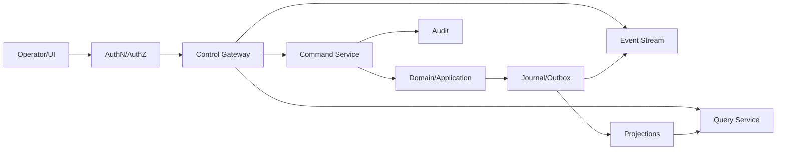

# Bot Control Plane

## 1. 목적

여러 Bot, Task, Core, Memory, 통신, 자원, Harness 상태를 중앙에서 관찰·운영하되 도메인 로직과 저장소를 우회하지 않는 관리 평면을 정의한다.

## 2. 책임 범위

- 관리 Command/Query/Event Stream
- Bot/Task/Core/Memory/Communication/Runtime 관리
- 운영자 권한, 승인, 감사
- Projection과 일관성 표시
- CLI/TUI/Web 공통 backend

개별 UI 렌더링은 `40-interfaces` 문서가 담당한다.

## 3. Control Plane 원칙

1. 모든 변경은 Application Command Handler를 통한다.
2. 조회는 Projection을 사용하며 stale/watermark를 표시한다.
3. Control Plane은 Bot의 Brain이 아니다.
4. 운영자 액션과 Bot 자율 액션을 명확히 구분한다.
5. 민감 작업은 approval와 audit를 요구한다.
6. 단일 노드에서도 API 계약을 사용한다.
7. Control Plane 장애가 이미 실행 중인 Core를 불필요하게 종료시키지 않는다.
8. 데이터베이스 편집 UI를 제공하지 않는다.

## 4. 기능 영역

### Bot 관리
- create/activate/deactivate/archive/restore/delete
- identity/profile/resource policy 변경
- export/import/clone
- health와 lifecycle history

### Task/Execution/Core
- submit/inspect/cancel/retry
- DAG와 delegation trace
- active Core/queue/lease
- result/artifact/trajectory
- manual approval/intervention

### Memory
- search/read/revision history
- create/correct/forget
- conflict/compaction/index status
- scope/sensitivity/retention
- provenance graph

### Communication
- inbox/outbox
- Bot relationship/topology
- delegation chain
- failed/expired/quarantined messages
- replay/reconcile 권한

### Runtime
- provider/adapter status
- model/tool/skill/sandbox catalog
- resource limit and usage
- config/version/migration
- background worker/projector health
- shutdown/reload/maintenance mode

## 5. Command와 Query 분리

Command 응답:
- accepted/committed/rejected
- command_id
- resulting aggregate revision
- event IDs
- asynchronous operation ID
- warnings

Query 응답:
- data
- projection version
- source watermark/as_of
- stale/degraded flags
- authorization filter summary
- pagination cursor

장기 작업은 `Operation` resource로 표시하고 polling/event stream을 제공한다. HTTP 연결이 끊겼다고 operation이 취소되지 않는다.

## 6. 데이터 흐름

## 7. 운영 액션의 안전장치

- bulk action dry-run
- 대상/영향/권한 summary
- expected revision
- idempotency key
- destructive action에 second approval
- rate limit
- scope 제한
- maintenance window/operation lock
- rollback 또는 compensating action
- audit reason 필수

`delete all`, `cancel all`, permission relax와 같은 action은 텍스트 일치 confirmation보다 구조화된 approval를 사용한다.

## 8. 일관성과 실시간 표시

- Command commit 이후 Projection 반영 전까지 UI는 pending state를 표시할 수 있다.
- Event Stream은 resume cursor를 제공한다.
- 연결 재개 시 snapshot + delta 방식으로 복구한다.
- Active Core 같은 volatile 정보도 persisted lease projection과 live heartbeat를 구분한다.
- "0 active"는 heartbeat fresh 여부와 함께 표시한다.
- Resource usage는 event가 아닌 metric time series일 수 있으며 정확한 billing record와 구분한다.

## 9. 예외상황

- Projection lag: write는 정상, query에 stale 표시
- Auth service unavailable: privileged write fail-closed, 정책에 따라 local break-glass
- Control API restart: operation/journal에서 상태 복원
- Event stream overflow: client cursor 재동기화 요구; server unbounded buffer 금지
- bulk action 부분 실패: 항목별 result와 compensation 상태 제공
- runtime version mismatch: incompatible command를 시작 전에 거부
- deleted Bot deep link: tombstone summary와 접근 정책
- audit sink failure: 민감 action은 fail-closed 또는 local durable spool

## 10. 확장성

Control Plane은 read-heavy이므로 Projection/API를 수평 확장할 수 있다. Command routing은 BotId ownership으로 분배한다. UI용 aggregate endpoint가 domain write contract를 오염시키지 않도록 BFF read composition만 허용한다. multi-tenant는 tenant scope를 모든 principal/query/event에 추가한다.

## 11. 구현 우선순위

- **P0:** 최소 local Control service를 CLI backend로 제공
- **P1:** Bot/Task/Core/Memory API, event stream, operation, audit
- **P2:** Web Control Center, bulk management, remote/multi-node
- **P3:** multi-tenant organization, policy analytics

## 12. 검증 기준

- CLI/TUI/Web이 같은 Command/Query schema를 사용한다.
- DB 직접 수정 없이 모든 관리 기능을 수행한다.
- Command commit과 Projection lag가 사용자에게 구분되어 표시된다.
- Event stream reconnect가 cursor로 누락 없이 복구된다.
- destructive action이 authorization, approval, audit 없이 실행되지 않는다.
- Control Plane 중단 중에도 실행 중 Core의 Runtime 의미가 유지된다.
