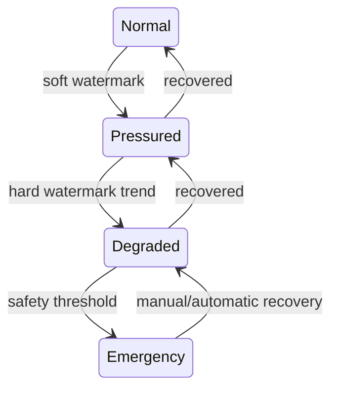

# 자원·비용·Admission 관리

## 1. 목적

다수 Bot/Core가 CPU, 메모리, 모델 토큰·비용, Tool, 네트워크, 저장소를 경쟁할 때 시스템 안정성과 공정성을 보장한다.

## 2. 책임 범위

- global/Bot/Task/Provider 자원 예산
- admission과 permit
- quota/rate limit/circuit breaker
- usage accounting
- overload/degraded mode
- 비용 예측과 hard/soft limit

OS 수준 세부 cgroup/container 구성은 배포 Provider가 담당한다.

## 3. 자원 차원

- Runtime Core 동시성
- CPU time / blocking workers
- resident memory / working memory / cache
- model requests / tokens / monetary cost
- Tool calls / subprocesses / PTY
- network concurrency / bandwidth
- storage capacity / IOPS / transaction time
- Artifact bytes
- Memory index/embedding work
- Bot-to-Bot messages/fan-out
- UI stream subscribers

한 개의 "max_concurrency"로 모든 자원을 대표하지 않는다.

## 4. 정책 계층

```text
Deployment hard ceiling
  └─ Tenant/Workspace budget
      └─ Bot budget
          └─ Goal/Task budget
              └─ Execution/Core grants
                  └─ individual Model/Tool call
```

하위 grant는 상위 잔여 예산을 초과할 수 없다. 정책은 immutable snapshot과 usage ledger revision을 사용한다.

## 5. Limit 종류

| 종류 | 의미 | 초과 처리 |
|---|---|---|
| Hard limit | 절대 초과 금지 | 거부/취소 |
| Soft limit | 경고·감쇠 지점 | 우선순위 하향/승인 |
| Rate limit | 시간당/초당 사용량 | queue/backoff |
| Concurrency limit | 동시 실행 수 | permit 대기 |
| Budget | 누적 비용/토큰/시간 | 중단/승인 |
| Reservation | 미래 작업에 확보 | 만료/회수 |
| Burst | 짧은 초과 허용 | token bucket 소진 |
| Safety reserve | 운영/복구용 여유 | 일반 Task 사용 금지 |

## 6. Admission 흐름

1. Work request의 요구 capability와 예상 자원을 추정한다.
2. lifecycle/permission/deadline을 확인한다.
3. hard ceiling과 현재 health를 확인한다.
4. global → Bot → provider → tool 순으로 permit/reservation을 획득한다.
5. 예산 reservation과 Core Lease를 원자적으로 연결한다.
6. 실제 usage를 streaming으로 반영한다.
7. 예상 대비 편차가 임계값을 넘으면 throttle/approval/cancel한다.
8. terminal에서 reservation과 actual을 정산한다.

정확한 비용이 사후에만 알려질 경우 상한 기반 reservation과 incremental accounting을 사용한다.

## 7. 메모리 관리

- Runtime 전체 RSS soft/hard watermark
- Bot별 hot state budget
- Core Working Context budget
- channel bytes budget
- Artifact spill threshold
- cache class별 budget과 eviction
- memory pressure 발생 시 신규 Core admission 축소
- low-priority cache/working set 정리
- OOM 직전까지 작업을 받지 않음
- allocator/heap profile과 retained owner 추적

item count만 제한하지 않고 bytes를 함께 제한한다.

## 8. 모델·비용 관리

- 요청 전 estimated input/output tokens와 cost class
- model/provider별 concurrency/rate
- Task/Goal/Bot 누적 budget
- retry가 같은 예산을 다시 소모함을 반영
- fallback model의 비용/품질 차이
- partial stream usage
- unknown billing은 conservative estimate
- 예산 초과 시 finish reason과 partial result 보존
- 사용자 승인으로 일시 grant 가능
- billing metric과 provider invoice reconciliation

## 9. 공정성

- per-Bot minimum share 또는 starvation protection
- priority aging
- system recovery/control work reserve
- interactive Task와 background Routine class 구분
- 한 Bot의 고비용 모델 요청이 전체 Tool execution을 막지 않도록 자원별 queue 분리
- 동일 principal의 fan-out budget
- fairness 결과와 queue delay를 관측

## 10. Overload 모드



- `Pressured`: fan-out 감소, cache trim, background 지연
- `Degraded`: 신규 low-priority Task 거부, 고급 검색/embedding 중지
- `Emergency`: 신규 실행 중지, durable checkpoint, 선택적 cancellation
- 모드 전이는 hysteresis를 사용해 진동을 방지한다.

## 11. Circuit Breaker

Provider별:
- rolling failure/timeout rate
- half-open probes
- max open duration
- fallback route
- auth/config 오류는 retry하지 않음
- provider health와 Task error를 구분
- breaker state를 restart 후 복원할지 정책화
- 전역 breaker가 서로 다른 credential/model을 과도하게 묶지 않게 key 설계

## 12. 예외상황

- usage report 누락: reservation 기준으로 보수적 정산 후 reconciliation
- permit leak: Lease terminal/reconciler가 회수
- provider quota 갑작스러운 감소: 신규 admission 즉시 감쇠
- disk full: write-heavy Task 중지, read/control reserve
- memory spike: stream spill, Core revoke, emergency checkpoint
- cost estimate 오류: tolerance와 post-run alert
- clock skew: monotonic interval과 provider server time을 분리
- user grant 중복: idempotency와 expiry
- recovery 작업이 quota에 막힘: safety reserve 사용

## 13. 확장성

원격 Worker가 추가되면 node-local 자원과 cluster budget을 계층적으로 관리한다. 중앙 Scheduler는 예약을 소유하고 Worker는 local enforcement를 수행한다. metric 기반 값은 근사치일 수 있으나 hard grant는 lease/fencing으로 보장한다.

## 14. 구현 우선순위

- **P0:** global/per-Bot Core, channel bytes, model request limit, basic usage ledger
- **P1:** cost budget, overload modes, breaker, Artifact/storage limits
- **P2:** cluster/node hierarchy, adaptive limit
- **P3:** 예측형 capacity planning

## 15. 검증 기준

- hard limit 초과가 부하 테스트에서도 발생하지 않는다.
- permit/예산 reservation이 crash/restart 후 reconciliation된다.
- 메모리 pressure에서 fan-out과 cache가 감소하고 Runtime이 OOM 없이 degraded된다.
- 한 Bot flood 시 다른 Bot의 최소 처리 기회가 보장된다.
- 모델 비용/토큰이 Task→Bot→Deployment 합계로 추적된다.
- circuit breaker가 auth 오류를 무한 재시도하지 않는다.
