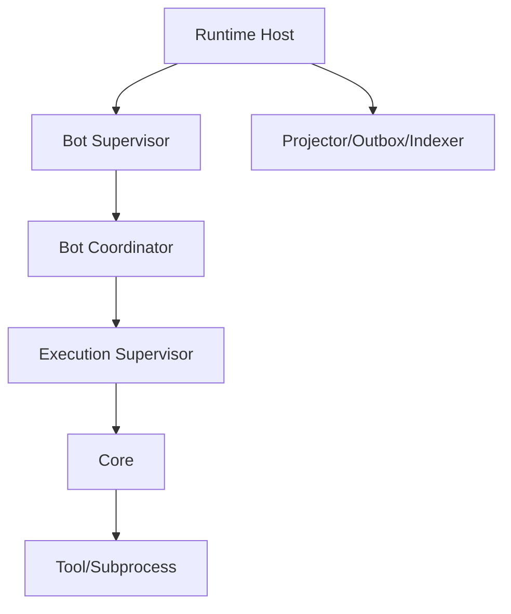

# 오류·복구·회복성

## 1. 목적

외부 모델/Tool/프로세스/저장소 장애와 내부 panic, crash, partial commit에서도 Bot의 지속성과 상태 일관성을 유지한다.

## 2. 책임 범위

- 오류 taxonomy와 재시도
- supervision과 crash loop
- checkpoint/reconciliation
- startup/shutdown recovery
- partial outcome
- degraded/maintenance mode
- 운영자 repair

## 3. 오류 분류

| 분류 | 예 | 기본 처리 |
|---|---|---|
| Validation | 잘못된 Command/schema | 즉시 reject, 재시도 금지 |
| Authorization | 권한/approval 부재 | fail-closed |
| Conflict | expected revision mismatch | reread/redecide 또는 사용자 충돌 |
| Resource | quota/memory/disk/queue | backpressure/degraded |
| Transient Provider | timeout, 5xx, disconnect | bounded retry |
| Permanent Provider | auth, unsupported model | retry 금지, config 요구 |
| Domain Invariant | 불가능한 상태 전이 | reject + defect signal |
| Corruption | checksum/event decode | quarantine/repair |
| Cancellation | user/system cancel | 정상 terminal 의미 |
| Internal Defect | panic, impossible branch | 격리, crash report |
| Security Incident | sandbox escape/secret leak 의심 | 즉시 quarantine/stop |

`anyhow`형 opaque message만으로 운영 결정을 하지 않는다. 오류에는 stable code와 retry disposition이 있어야 한다.

## 4. Outcome 독립성

하나의 실행 결과에 다음이 동시에 존재할 수 있다.
- timed_out
- cancellation requested
- process signal
- exit code
- partial result
- provider finish reason
- validation failed
- cleanup incomplete

하나의 enum이 정보를 소실한다면 terminal kind와 orthogonal detail을 분리한다.

## 5. Supervision Tree

- child panic이 sibling 전체를 자동 종료시키지 않는다.
- 보안/저장 invariant 오류는 더 높은 scope를 격리할 수 있다.
- restart policy는 component별 budget과 backoff를 가진다.
- crash loop 시 degraded/quarantine로 전환한다.
- supervisor는 child 종료를 await하고 orphan을 기록한다.

## 6. Startup Recovery

1. process lock/ownership 확인
2. config/schema/migration 검증
3. storage integrity quick check
4. pending migration/backup marker reconcile
5. outbox/inbox/idempotency recovery
6. Core Lease/Execution 재조정
7. incomplete Artifact finalize/orphan cleanup
8. projection/index checkpoint 확인
9. Bot lazy activation
10. health ready 전환

Ready는 API port가 열렸다는 뜻이 아니라 P0 write path가 안전함을 의미한다.

## 7. Execution Recovery

미완료 Execution 판정:
- no lease/never started → reschedule
- active local child exists → reattach 불가 시 cancel/retry
- remote lease valid → observe
- lease expired, no side effect → retry
- side effect unknown → reconciliation/manual
- checkpoint compatible → new attempt with checkpoint
- provider resume incompatible → new attempt 또는 fail
- cancellation pending → cancellation 계속

재시도는 새 Execution attempt를 만들고 과거 trace를 연결한다.

## 8. Checkpoint

Checkpoint는 다음을 가질 수 있다.
- Task/Execution revision
- completed work item set
- pending work
- Artifact references/digests
- Harness resume token + provider version
- side-effect ledger
- selected Memory/Policy revisions
- timestamp/sequence
- checksum

전체 Working Context heap dump를 checkpoint하지 않는다. 재현 가능한 최소 상태만 저장한다.

## 9. Retry 정책

- max attempts, elapsed time, cost, deadline
- error class별 backoff
- idempotent/side-effect risk
- alternate provider 여부
- jitter
- circuit breaker
- manual approval threshold
- partial result reuse
- retry storm 방지 global budget

동일 오류를 무한 반복하지 않고 fingerprint 기반 suppression/incident를 제공한다.

## 10. Degraded 모드

- read-only: 저장 write 불가
- no-new-execution: 기존 작업만 정리
- model-disabled: 조회/관리만
- search-degraded: exact Memory 조회만
- artifact-degraded: inline 상한 내 결과만
- bot-quarantined: 특정 Bot 정지
- maintenance: migration/repair용

모드는 원인, 시작 시간, 허용 기능, 복구 조건을 명시한다.

## 11. Repair와 Doctor

`doctor`는:
- schema/version
- journal continuity
- snapshot digest
- projection lag
- orphan lease/permit
- outbox poison
- dangling Artifact
- stale lock
- index status
- provider compatibility
- secret/config availability
를 검사한다.

자동 repair는 안전하고 멱등인 작업만 수행한다. Event 삭제·재작성 같은 비가역 조치는 백업과 명시 승인 없이 하지 않는다.

## 12. 예외상황

- shutdown 중 new callback: listener registry를 먼저 close해 무시/기록
- process kill 실패: child tree 추적과 escalation, 완료 전 반환 금지
- DB commit 결과 unknown: idempotency lookup으로 판정
- backup 중 crash: marker로 불완전 backup 폐기
- Event version unknown: 관련 Bot만 quarantine 가능하면 전체 Runtime을 막지 않음
- repeated poison projection event: projection별 격리
- system clock 역행: monotonic timer
- low disk로 audit 실패: emergency reserve와 write stop

## 13. 확장성

분산 환경에서는 node loss, network partition, split-brain을 Lease/fencing과 idempotent reconciliation로 처리한다. 복구 logic은 transport-specific callback이 아니라 persisted state에서 결정한다.

## 14. 구현 우선순위

- **P0:** error codes, retry disposition, startup recovery, graceful shutdown, execution reconciliation
- **P1:** doctor/repair, degraded modes, crash-loop supervisor, checkpoints
- **P2:** distributed recovery, backup automation, disaster recovery
- **P3:** 자동 원인 분석과 remediation recommendation

## 15. 검증 기준

- 임의 kill 지점 fault injection 후 invariant가 유지된다.
- DB commit 응답 손실 후 동일 Command 재전송이 중복 상태를 만들지 않는다.
- child process가 signal을 무시해도 shutdown이 timeout/escalation 결과를 정확히 기록한다.
- corrupt snapshot은 Event replay로 복구되거나 Bot quarantine로 제한된다.
- retry storm이 global budget을 초과하지 않는다.
- `doctor`가 의도적으로 만든 orphan/lag/corruption을 탐지한다.
