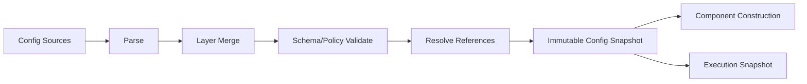

# 구성·프로파일·배포

## 1. 목적

환경·Bot·Task별 설정을 일관된 우선순위와 검증 가능한 Snapshot으로 구성하고, 단일 노드부터 원격 배포까지 동일한 Runtime 의미를 유지한다.

## 2. 책임 범위

- config sources/precedence/schema
- profile와 override
- secret reference
- hot reload
- single-process/service/container 배포
- upgrade/rollback
- environment portability

## 3. 구성 계층

낮은 우선순위부터:
1. compiled safe defaults
2. installation/deployment config
3. workspace/project config
4. runtime profile
5. Bot profile
6. Goal/Task policy override
7. one-shot execution override
8. emergency restriction

상위 계층은 허용된 key만 override한다. 보안 hard ceiling은 하위 계층이 완화할 수 없다.

## 4. 구성 영역

- storage/artifact/index
- harness/model/tool/skill/provider
- sandbox/permission/approval
- scheduler/resource/cost
- memory/retention/context
- Bot defaults
- control transport/auth
- observability/audit
- backup/maintenance
- feature gates
- deployment/node identity

각 key는 owner, type, default, valid range, reloadability, sensitivity, scope, deprecation을 가진다.

## 5. 로드 흐름

문자열 merge가 아니라 typed merge를 사용한다. unknown key는 기본적으로 오류다. config에 실행 코드/임의 스크립트를 허용하지 않는다.

## 6. Profile

Profile은 capability와 policy 조합이다.
- `minimal`: Fake/local model, 최소 Tool
- `developer`: shell/fs/tool, 강화 sandbox
- `headless`: UI 없음, automation API
- `control`: Control Plane 중심
- `benchmark`: deterministic limits/telemetry
- custom profile

Profile이 Bot Identity를 정의하지 않는다. Bot profile은 역할/권한/자원 기본값을 참조한다.

## 7. Config Snapshot

각 Execution은 시작 시:
- config generation
- Brain/Policy revisions
- provider selection/config digest
- resource limits
- sandbox/permission
을 pin한다.

Reload는 신규 Execution부터 적용한다. 보안 제한 강화와 emergency stop은 진행 중 실행에도 별도 control signal로 적용할 수 있다. Snapshot에는 secret 원문이 없다.

## 8. Hot Reload

Reload 가능:
- logging level/sampling
- soft resource limits
- provider routing weight
- UI/query settings
- 일부 Bot defaults

Restart 또는 quiescence 필요:
- storage backend
- schema
- control bind/auth mode
- sandbox provider
- cryptographic keys
- plugin ABI/wire protocol
- hard resource topology

Reload 과정은 parse/validate/build candidate → atomic generation swap → old generation drain 순서다.

## 9. 배포 형태

### P0 Embedded/Daemon
- 하나의 `dxb-daemon`
- embedded DB/artifact
- local socket
- CLI client
- optional DeepSeek sidecar

### P1 Service
- daemon system service
- remote HTTP/control auth
- external model/provider
- backup/monitoring
- TUI remote client

### P2 Distributed
- Control/API nodes
- Bot ownership/runtime nodes
- remote Core workers
- external DB/artifact/index
- message transport

초기부터 microservice로 분해하지 않는다. 논리 Port가 검증된 뒤 병목/격리 요구에 따라 프로세스를 분리한다.

## 10. 파일과 디렉터리

논리 경로:
- home/config
- data database
- artifacts
- runtime sockets/pid/locks
- cache/index
- logs/audit spool
- backups
- provider/plugin packages
- per-Bot workspace

경로는 절대화·권한 검증하고 사용자 입력을 직접 concatenate하지 않는다. data와 cache를 구분해 cache 삭제가 Canonical State를 손상시키지 않게 한다.

## 11. Upgrade와 Rollback

- binary/config/schema/harness adapter compatibility matrix
- startup preflight
- backup/checkpoint
- migration
- canary Runtime/profile
- smoke/conformance
- traffic/admission 전환
- rollback 가능성 판단
- irreversible migration은 별도 승인

DeepSeek Harness 등 preview dependency는 exact version/digest pin과 canary suite를 사용한다. 자동 최신 추종을 금지한다.

## 12. 예외상황

- unknown config key: fail startup
- deprecated key: 경고+정해진 종료 version, silent ignore 금지
- secret missing: 해당 provider unavailable/degraded, raw fallback 금지
- reload candidate 일부 실패: 기존 generation 유지
- config file partial write: atomic replace와 last-known-good
- disk read-only: config 변경 거부, Runtime 모드 표시
- profile dependency cycle: load reject
- two daemon same data dir: ownership lock으로 두 번째 거부
- sidecar version mismatch: adapter disabled 또는 startup fail based on required flag

## 13. 확장성

분산 config service가 추가되어도 typed snapshot과 generation contract를 유지한다. node-local override는 허용 범위를 명시한다. Bot 수가 커지면 profile inheritance를 compact diff로 저장하고 full materialization은 cache한다.

## 14. 구현 우선순위

- **P0:** typed config, precedence, validation, local daemon, data dirs, last-known-good
- **P1:** hot reload subset, remote service, profile manager, canary upgrade
- **P2:** distributed config, node roles, zero-downtime migration
- **P3:** 정책 시뮬레이션과 staged rollout automation

## 15. 검증 기준

- 동일 config sources가 deterministic digest를 만든다.
- unknown key와 range 오류가 startup 전에 차단된다.
- secret가 config snapshot/export에 포함되지 않는다.
- reload 실패 시 기존 generation이 계속 동작한다.
- 같은 data directory에 writer daemon 두 개가 뜨지 않는다.
- cache/index 디렉터리 삭제 후 Canonical Bot/Memory가 복구된다.
- pinned Harness upgrade가 conformance 없이 배포되지 않는다.
