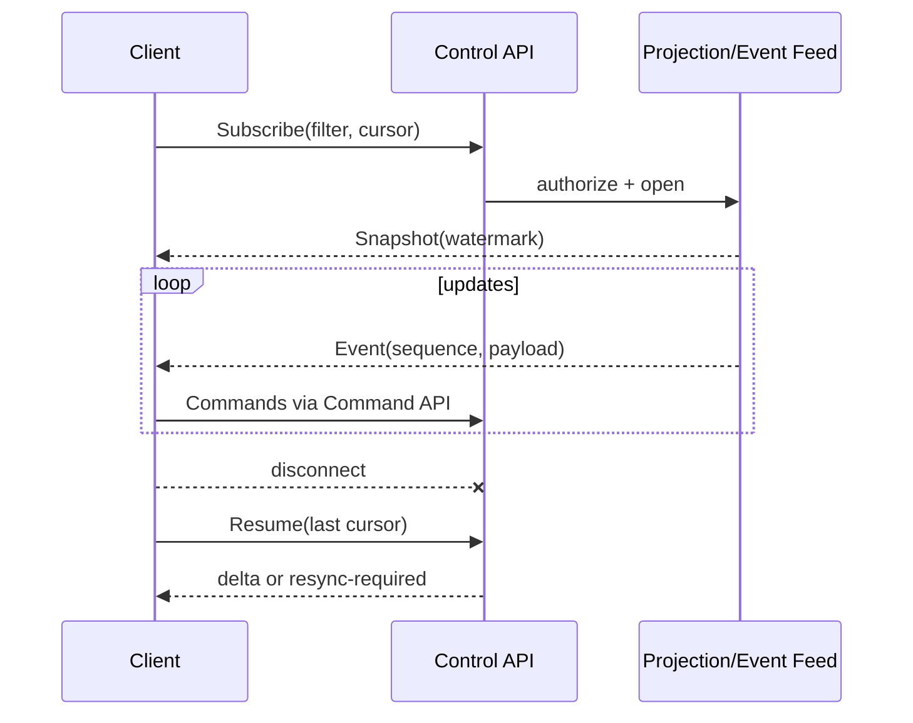

# Control API와 프로토콜

## 1. 목적

CLI, TUI, Web, IDE, 외부 자동화가 동일한 Runtime 계약을 사용하도록 Command/Query/Event/Artifact 프로토콜을 정의한다.

## 2. 책임 범위

- local/remote transport
- API versioning
- command, query, operation, event stream
- error와 idempotency
- pagination, filtering, consistency
- authentication/authorization context
- client SDK

Domain 내부 Rust trait 또는 DB schema를 wire contract로 그대로 노출하지 않는다.

## 3. 프로토콜 표면

### Command API
상태 변경:
- Bot lifecycle/identity
- Goal/Task/Execution action
- Memory create/correct/forget
- Core/Runtime control
- Bot Message/delegation
- permission/approval/config operation

### Query API
- list/get/search/trace
- Task graph, Memory relations, Bot topology
- active Core/resource/health
- audit/operation status
- capability/config catalog

### Event Stream
- Domain event projection
- operation progress
- active runtime status
- model/tool execution summary
- approval request
- alert

### Artifact API
- metadata
- upload/download with digest
- range/stream
- retention/delete
- signed/short-lived access token for remote

## 4. Transport 전략

- P0: local Unix domain socket 또는 Windows named pipe
- P1: HTTP 기반 remote API
- streaming: SSE를 기본 단방향 이벤트로 검토, 양방향 상호작용은 WebSocket 또는 별도 Command
- internal remote worker: 별도 binary protocol/RPC를 사용할 수 있으나 Control API와 분리
- DeepSeek ACP/JSON-RPC는 Harness Adapter 내부 protocol이며 DXBOT Control API가 아니다

동일 schema와 client abstraction을 local/HTTP transport가 구현한다.

## 5. Versioning

- API major/minor 또는 explicit schema version
- path/header negotiation
- request/response/event 각각 version
- additive optional field를 우선
- unknown field 처리 명시
- enum unknown variant 보존/거부 정책
- deprecation window
- server capability discovery
- client minimum/maximum compatibility
- Event Stream resume cursor는 version과 projection generation 포함

Rust enum을 wire에서 비확장 closed enum으로 무심코 노출하지 않는다.

## 6. Command Envelope

논리 필드:
- command_id
- command_type/version
- actor/principal context
- target resource
- expected_revision
- idempotency_key + scope
- correlation/causation
- deadline
- dry_run
- payload
- client metadata

응답:
- outcome: committed/accepted/rejected/conflict
- resulting revision/events
- operation ID
- validation errors
- warnings
- server version/watermark

HTTP timeout 또는 client disconnect가 committed Command를 취소하지 않는다. idempotency 조회로 결과를 복구한다.

## 7. Query 계약

- 명시적 filter/sort
- stable cursor pagination
- limit hard cap
- projection watermark/stale
- `as_of` 또는 minimum revision 옵션
- field selection은 필요한 경우에만
- permission-filtered count의 의미
- 대용량 graph/query complexity budget
- content redaction/sensitivity

사용자 입력 정렬 필드를 SQL 문자열로 직접 연결하지 않는다.

## 8. Event Stream

- per-client buffer bounded
- slow client는 disconnect/resync
- heartbeat
- duplicate 가능, sequence로 dedup
- security filter는 snapshot과 delta 모두 동일
- raw model token stream은 별도 opt-in trace channel이며 Control Event 기본값이 아님

## 9. 오류 형식

- stable code
- category
- human message
- retry disposition
- field violations
- resource/current revision
- operation/correlation ID
- safe details
- internal cause는 server log/trace에만

Transport status와 Domain status를 분리한다. 예: HTTP 성공 응답 안에 실패를 숨기지 않되, long-running accepted 의미를 명확히 한다.

## 10. 인증과 권한

- local socket peer identity
- remote token/session/mTLS 후보
- principal chain과 tenant/workspace scope
- Command별 authorization
- query row/field filter
- stream filter
- artifact access token
- CSRF/origin(Web)
- rate limit
- audit reason for privileged calls

UI가 전달한 role string을 신뢰하지 않는다.

## 11. 성능·메모리

- request/response size hard cap
- streaming decoder
- zero/low-copy body to Artifact upload
- compressed response는 CPU budget과 함께
- repeated metadata dictionary/cache
- client connection/subscription limit
- pagination으로 전체 목록 materialization 금지
- backpressure를 transport까지 전달
- JSON은 Control 호환성을 위해 사용할 수 있으나 hot internal worker path와 분리

## 12. 예외상황

- client/server version mismatch: capability negotiation 후 명확한 upgrade error
- cursor too old: snapshot resync
- command response lost: idempotency lookup
- upload interrupted: temporary artifact expiry
- event authorization changed: stream 재인증/종료
- server draining: 신규 command 제한과 retry-after
- partial bulk operation: item별 status
- malformed payload: parser budget 내 reject
- duplicate stream event: client sequence dedup

## 13. 확장성

외부 SDK는 generated types에 의존할 수 있으나 Domain crate를 import하지 않는다. 향후 gRPC/Message transport가 추가되어도 Command/Query semantics와 error codes를 유지한다. multi-tenant에서 scope를 모든 cursor/idempotency key에 포함한다.

## 14. 구현 우선순위

- **P0:** local transport, Bot/Task/Memory 기본 Command/Query, stable errors, idempotency
- **P1:** HTTP, event stream, artifact, SDK, approval
- **P2:** remote worker protocol, multi-tenant, API gateway
- **P3:** third-party public SDK ecosystem

## 15. 검증 기준

- CLI와 in-process test client가 같은 schema/client를 사용한다.
- 응답 손실 후 idempotency key로 결과를 복원한다.
- slow stream client가 server memory를 무제한 증가시키지 않는다.
- cursor resume가 event 누락 없이 동작하거나 명확히 resync한다.
- API schema 변경이 compatibility test와 migration note 없이 통과하지 않는다.
- raw secret/internal error가 wire에 노출되지 않는다.
