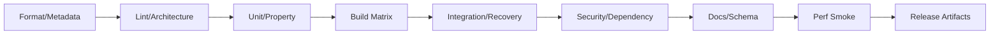

# Repository·CI·Release 운영

## 1. 목적

아키텍처 의존성, 코드 품질, 중복 금지, 보안, 테스트, 성능, 문서 추적성을 자동화해 장기 유지보수 가능한 개발 흐름을 만든다.

## 2. 책임 범위

- repository layout와 ownership
- branch/PR/change set
- CI stages
- dependency/security/license
- artifact/release
- platform matrix
- generated code/docs
- release evidence

## 3. Repository 원칙

- 단일 Rust workspace로 P0 시작
- 문서와 코드의 같은 repository
- crate owner와 domain owner
- generated file source-of-truth 명시
- examples는 실제 public API 사용
- fixtures는 versioned
- benchmark datasets는 크기/라이선스 관리
- secret와 local data ignore
- binary artifacts commit 금지
- migration/ADR/docs를 code change와 함께 관리

## 4. Branch와 PR

- 작은 의미 단위
- PR 설명에 requirement/ADR/issue
- schema/API/event/config 영향
- memory/performance/security 영향
- tests/commands executed
- migration/rollback
- screenshots는 UI 변경에만 보조
- generated diff 검증
- temporary compatibility code의 제거 issue
- self-review checklist

장기 feature branch에서 대규모 통합을 피하고 feature gate로 incremental merge한다.

## 5. CI Pipeline

### Fast Gate
- formatting
- compile/check
- lints
- forbidden dependency/API
- unit/property focused
- doc links/IDs
- generated files clean

### Full Gate
- all features/platform representatives
- storage/recovery
- fake Harness E2E
- concurrency
- security/sandbox
- migration fixtures
- coverage/mutation candidates
- performance smoke
- package/reproducibility

### Scheduled
- soak
- actual DeepSeek Harness canary
- dependency vulnerability/license
- backup restore
- fuzz
- full platform
- benchmark trend

## 6. Architecture Gates

자동 검사:
- crate dependency allowlist
- Domain의 infrastructure dependency 금지
- unbounded channel 금지
- production unwrap/unsafe allowlist
- `common/utils/helpers` 신규 모듈 경고
- public type/API diff
- duplicate code/state schema 후보
- event/API/config schema version
- canonical owner metadata
- blocking call in async path 후보
- large struct/enum size regression 후보
- feature flag matrix

정적 도구 결과는 오탐 관리와 exception file/expiry를 가진다.

## 7. Quality Tools 후보

정확한 도구 선택은 ADR로 고정하되 기능군:
- formatter/linter
- test runner
- coverage
- property/fuzz/concurrency model
- dependency audit/deny/license
- unused dependency
- semver/API diff
- binary size
- duplicate code
- benchmark
- sanitizer/Miri
- SBOM
- docs link/schema validation

도구를 추가하는 목적은 규칙을 자동화하는 것이며 CI 시간만 늘리는 중복 도구를 피한다.

## 8. Build/Profile

- dev/test/release profile 분리
- debug symbols와 panic strategy 결정
- LTO/codegen units는 build time/size/CPU benchmark
- reproducible build metadata
- target feature의 portable baseline
- native dependency와 cross compile
- sidecar/package bundling
- version/commit/schema catalog embed
- release binary `--version --verbose`

## 9. Platform Matrix

P0:
- Linux primary
- macOS development/support
- Windows compile/basic runtime

P1:
- filesystem/process/sandbox behavior matrix
- path/link/permission differences
- terminal/TUI
- local socket/named pipe
- service install
- actual DeepSeek sidecar support

지원하지 않는 보안 capability는 silent degrade가 아니라 fail-closed/unsupported로 표시한다.

## 10. Release 절차

1. branch freeze 불필요한 trunk-based candidate
2. changelog/ADR/migration review
3. clean full CI
4. migration fixture + backup restore
5. Harness compatibility canary
6. SBOM/license/security
7. signed/checksummed artifacts
8. install/upgrade/rollback smoke
9. release notes: breaking/security/data
10. staged/canary deploy
11. post-deploy metrics
12. rollback criteria

## 11. Version 정책

Pre-1.0에서도 persistent data와 API를 함부로 깨지 않는다. 개발 중 breaking change는 migration과 explicit release note를 요구한다. Internal crate version과 product version 정책은 별도 ADR로 정한다.

## 12. 예외상황

- flaky CI: owner/issue/expiry 없이 retry-only 처리 금지
- external provider outage: canary nonblocking이나 명확한 failed signal
- security advisory: expedited patch + 문서 후속
- platform runner unavailable: risk 표시, release tier 판단
- benchmark noisy: gated environment 분리
- dependency yanked: lockfile/source cache와 review
- generated file drift: CI fail
- migration fixture missing: schema release 차단
- release artifact mismatch: checksum/repro build 조사

## 13. 확장성

repository split은 독립 릴리스/권한/빌드 요구가 실제 생길 때만 한다. Web frontend가 별도 저장소가 되어도 API schema artifact와 compatibility gate를 공유한다. third-party plugin SDK는 별도 release train 가능하다.

## 14. 구현 우선순위

- **P0:** fast/full CI, architecture/lint/test/migration/docs, release binary
- **P1:** security/perf/soak/platform/Harness canary
- **P2:** distributed deployment/repro signing/plugin SDK pipeline
- **P3:** automated policy compliance dashboard

## 15. 검증 기준

- 금지 crate dependency와 unbounded channel PR이 CI에서 차단된다.
- schema 변경에 migration fixture와 version diff가 필수다.
- release artifact가 install/upgrade/rollback smoke를 통과한다.
- docs links/traceability/generated files가 clean하다.
- actual Harness canary 실패가 기본 Provider 승격을 막는다.
- CI exception은 owner와 expiry가 없는 경우 허용되지 않는다.
