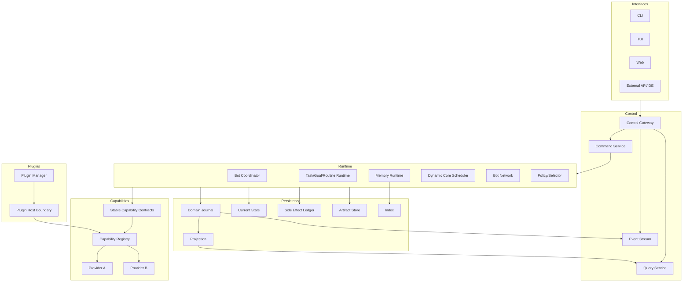

# 전체 시스템 아키텍처

## 1. 목적

DXBOT의 Core Domain을 작고 안정적으로 유지하고, 선택 기능을 Capability/Provider/Interface/Plugin 경계로 분리해 교체·복수 선택·추가·제거를 가능하게 한다.

## 2. Architecture Classification

```text
Core Domain
  ├─ Bot / Identity / Brain / Memory / Goal / Task / Execution / Core Lease
  ├─ Command / Domain Event / Canonical State / Policy semantics
  │
Application / Runtime
  │
Stable Capability Contracts
  ├─ Provider A
  ├─ Provider B
  └─ Provider C

Interfaces ──> Control API ──> Application
Plugins ──stable host/wire contract──> Plugin Runtime/Capability Registry
```

Core Domain은 Provider/Plugin/Interface 타입을 알지 않는다.

## 3. 핵심 계층

| 계층 | 책임 | 금지 |
|---|---|---|
| Core Domain | 제품 의미, 상태기계, 불변조건 | DB/Provider/UI/Plugin 타입 참조 |
| Application | Use Case, Unit of Work, idempotency, side-effect orchestration | Domain rule 복제 |
| Runtime | Bot coordinator, scheduler, execution, background lifecycle | UI 로직 소유 |
| Capability Contract | 교체 지점의 안정 의미 | 특정 Provider 가정 |
| Provider | Capability 구현과 외부 시스템 변환 | Domain schema 변경 |
| Plugin Runtime | 외부 패키지 lifecycle/isolation/permission | 내부 trait ABI 공개 |
| Persistence | Journal/State/Artifact/Projection/Index | Provider state를 Domain truth로 승격 |
| Control | Command/Query/Event/Operation | DB 직접 쓰기 |
| Interface | CLI/TUI/Web/API 표현 | Domain 판단/영속화 |

## 4. 논리 구조



## 5. Provider Selection

Provider selection은 별도 `Selector/Policy` 책임이다.

1. Runtime은 Execution 요구 Capability를 결정한다.
2. Registry snapshot에서 compatible Provider set을 조회한다.
3. selector가 Bot profile, Task override, policy, availability, budget을 기반으로 **명시적 선택**한다.
4. 선택 결과와 config digest/version을 Execution에 pin한다.
5. 해당 Execution이 terminal이 될 때까지 Provider를 바꾸지 않는다.
6. fallback이 필요하면 새 Execution attempt를 만든다.

등록 순서나 global mutable default로 Provider를 정하지 않는다.

## 6. 정상 실행 흐름

1. Interface가 Command를 Control API로 제출한다.
2. Application이 auth/idempotency/expected revision을 검증한다.
3. Domain이 상태 전이를 결정하고 Journal/Current State/Outbox를 Commit한다.
4. Task가 실행 가능하면 Scheduler가 resource admission과 Core Lease를 만든다.
5. Selector가 Provider를 정하고 Execution snapshot에 기록한다.
6. Core는 immutable Brain/Memory/Policy snapshot으로 Capability Contract를 호출한다.
7. 외부 Side Effect 전에는 ledger Intent가 먼저 Commit된다.
8. Provider 결과는 Adapter에서 normalized outcome으로 변환된다.
9. Task/Execution/Memory Proposal을 Commit한다.
10. Projection과 Event Stream이 갱신된다.

## 7. Waiting/Routine/Recovery

- Routine trigger는 직접 Harness를 실행하지 않고 Task를 생성한다.
- Task가 Waiting으로 전이될 때 Continuation을 같은 Unit of Work에 저장한다.
- 재시작 시 Routine occurrence, Waiting Continuation, Core Lease, Side Effect Ledger를 순서대로 reconcile한다.
- Provider 세션이 살아 있다는 사실만으로 Task를 resume하지 않는다.
- Side Effect가 Unknown이면 status lookup/compensation/manual reconciliation 전 자동 retry하지 않는다.

## 8. Feature Removal

Provider/Plugin/Interface 제거는 Domain을 변경하지 않고 Registry/Config/API/Persistence 경계에서 처리한다. 제거된 Provider를 참조하는 새 Execution은 명시적 `unsupported/unavailable` 결과를 받는다. 기존 Bot Identity/Memory/Task 데이터는 그대로 복원 가능해야 한다.

## 9. 확장성

원격화 가능한 경계는 CoreExecutor, BotTransport, ArtifactStore, Event Stream, Provider Wire, Plugin Host다. 단일 노드에서 의미를 먼저 완성하며 분산화 때문에 Bot/Core/Task 의미를 바꾸지 않는다.

## 10. 검증 기준

- Domain dependency graph에 Provider/Plugin/UI crate가 없다.
- Provider A를 삭제한 build가 Domain/Core Runtime을 compile하고 DB를 복원한다.
- Provider A/B가 동시에 등록되어 Bot/Task별 선택이 가능하다.
- feature disabled/removed 상태가 API에서 명시적으로 보인다.
- crash 후 Waiting/Routine/Side Effect 상태가 persisted source로 복구된다.
