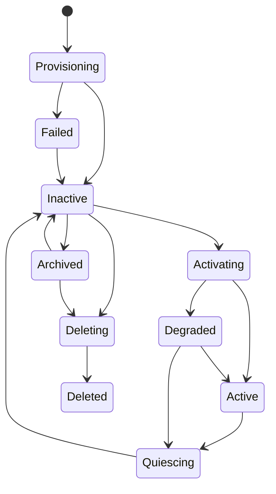

# Bot Identity와 Lifecycle

## 1. 목적

Bot을 Session·프로세스·모델·Harness Provider와 독립적으로 지속시키고 Identity/Lifecycle과 Routine/Capability availability의 관계를 명확히 한다.

## 2. Bot Aggregate

Canonical 구성:
- BotId
- Identity revision
- lifecycle state
- Brain policy reference
- Memory namespace
- Goal references
- Permission/Resource policy references
- Routine references 또는 owner relation
- workspace/provenance
- aggregate revision

비Canonical:
- active Core 목록
- UI Session 목록
- Provider runtime handle/session
- cache/index state
- currently loaded Plugin objects

## 3. Lifecycle

`Archived`에서는 신규 Routine trigger와 신규 Task admission을 기본 차단한다.

## 4. Provider/Capability와 Identity 분리

- Bot Identity에 concrete Harness/Model Provider type을 저장하지 않는다.
- Bot profile은 stable Capability requirement와 optional provider preference/selector policy reference를 가질 수 있다.
- Provider가 제거되어도 Bot Identity revision을 migration하지 않는다.
- required capability가 없으면 Bot은 capability-specific operation에 `Unavailable/Unsupported`를 반환하거나 정책상 Degraded가 될 수 있다.
- Provider 복구가 Bot clone/restore를 의미하지 않는다.

## 5. Routine 소유권

Routine은 Bot이 소유하는 영속 자동 실행 정의다.

Bot lifecycle과의 기본 관계:
- `Active`: enabled Routine trigger 허용
- `Degraded`: capability/resource 조건에 따라 trigger를 queue/skip
- `Quiescing`: 신규 occurrence claim 중지, 이미 생성된 Task는 일반 shutdown 정책 적용
- `Inactive`: trigger 실행 중지. missed-run 처리 여부는 Routine policy로 기록
- `Archived`: 신규 trigger 금지
- `Deleting/Deleted`: Routine disable 후 retention/purge 정책 적용

Bot deactivate가 Routine 정의 자체를 삭제하지 않는다.

## 6. Routine 활성화 복구

Bot activation 시:
1. Bot/Identity/Memory namespace 복원
2. enabled Routine 정의 load
3. persisted last/next occurrence와 current clock 비교
4. missed occurrence policy 적용
5. occurrence idempotency 확인
6. 필요한 일반 Task 생성
7. next occurrence 계산/commit

Provider availability는 Task 실행 시 selector가 판단하며 Routine 자체가 Provider를 pin하지 않는다. 필요하면 Task template에 capability requirement를 포함한다.

## 7. Identity 변경

Identity는 immutable revision을 추가한다. 진행 중 Execution은 시작 revision을 유지한다. Permission/security restriction 강화는 별도 policy control로 더 빠르게 적용할 수 있으나 Persona/Role/Provider preference 변경은 신규 Execution부터 적용한다.

## 8. 비활성화와 Quiescence

- 신규 Task/Routine occurrence admission 중지
- Core/Execution quiesce/cancel
- pending Memory Proposal commit/abort
- Waiting Task Continuation은 보존
- Side Effect Ledger Unknown은 reconciliation 대상으로 보존
- subscriptions 차단
- outbox/checkpoint flush
- child process/channel 종료 확인
- coordinator drop

취소 토큰 발행만으로 deactivate 완료 처리하지 않는다.

## 9. Session

마지막 Session 종료는 Bot lifecycle을 변경하지 않는다. 여러 Session의 충돌 Command는 expected revision/application policy로 직렬화한다. Session 삭제가 Bot/Memory/Routine/Task를 삭제하지 않는다.

## 10. 검증 기준

- Provider 제거 후 같은 BotId/Identity/Memory namespace가 복원된다.
- inactive/archive 전환이 Routine 정의를 삭제하지 않는다.
- archived Bot에서 신규 Routine Task가 생성되지 않는다.
- activate restart가 missed occurrence를 policy대로 한 번만 처리한다.
- deactivate 완료 시 owned Core/process/channel이 0이고 Waiting Continuation은 유실되지 않는다.
