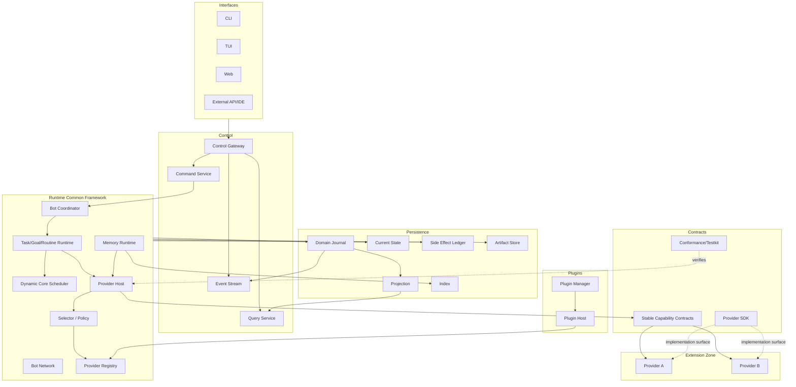

# 전체 시스템 아키텍처

## 1. 목적

DXBOT의 Core Domain을 작고 안정적으로 유지하면서 Common Framework가 cross-cutting correctness를 중앙 소유하고, 선택 기능은 정형화된 Stable SPI Extension Slot으로만 구현되게 한다.

## 2. 목표 구조

```text
Core Domain
  ├─ Bot / Identity / Brain / Memory / Goal / Task / Execution / Core Lease
  └─ Domain State / Invariant / Event Semantics
        ↓
Application / Runtime Common Framework
  ├─ Policy / Recovery / Side Effect orchestration
  ├─ Capability Contracts
  ├─ Provider Lifecycle / Registry / Selector
  ├─ Provider Host
  ├─ Permission / Resource / Deadline / Cancellation
  ├─ Error Normalization / Telemetry / Audit / Config / Compatibility
  └─ Testkit / Conformance / SDK / CI Gates
        ↓ Stable SPI Boundary
  ├─ Provider A
  ├─ Provider B
  └─ Provider C

Interfaces ──> Control API ──> Application
Plugins ──stable Plugin Host/Wire──> Plugin Manager ──Provider registration──> Registry
```

Core Domain은 Provider/Plugin/Interface 타입을 알지 않는다. Provider는 Common 내부 서비스를 탐색하는 service locator를 받지 않는다.

## 3. 핵심 계층

| 계층 | 책임 | 금지 |
|---|---|---|
| Core Domain | 제품 의미, 상태기계, 불변조건 | DB/Provider/UI/Plugin/Host 구현 참조 |
| Application | Use Case, Unit of Work, idempotency, side-effect orchestration | Domain rule 복제 |
| Runtime Common | coordinator, scheduler, recovery, Provider lifecycle/registry | UI 로직 소유 |
| Capability Contract | 교체 지점의 안정 I/O/실패/취소/자원/버전 의미 | 특정 Provider 가정 |
| Provider Host | 모든 Provider invocation 공통 enforcement와 selection binding | Domain state machine 소유 |
| Provider SDK | Extension에 허용된 stable helper/test surface | Runtime internals 재노출 |
| Provider | 외부 SDK/API + Capability-specific 구현/매핑 | permission/retry/admission/scheduler/persistence 재구현 |
| Plugin Runtime | 외부 package lifecycle/isolation/permission | Provider Host 우회, 내부 trait ABI 공개 |
| Persistence | Journal/State/Artifact/Projection/Index | Provider state를 Domain truth로 승격 |
| Control | Command/Query/Event/Operation | DB 직접 쓰기 |
| Interface | CLI/TUI/Web/API 표현 | Domain 판단/영속화 |

## 4. 논리 구조



Scheduler는 concrete Provider selection/permit을 소유하지 않는다. Provider Host가 Selector/Registry를 사용한다.

## 5. Provider Host 실행 흐름

1. Consumer가 Capability Request를 생성한다.
2. Host가 schema/capability metadata를 검증한다.
3. 기존 Execution Capability binding이 있으면 pinned `ProviderSelectionRef`를 검증하고, 없으면 compatible Provider set을 조회한다.
4. 신규 binding이면 Selector가 explicit policy로 Provider를 고르고 provider/version/config/registry generation을 pin한다.
5. Host가 permission/approval과 Provider-specific resource admission을 집행한다.
6. effective deadline/cancellation을 wiring한다.
7. Side Effect classification에 따라 intent/idempotency guard를 준비한다.
8. 공통 telemetry/audit context를 시작한다.
9. Provider SPI를 호출한다.
10. 결과/오류를 stable outcome으로 normalize하고 output/resource limit을 검증한다.
11. usage/accounting과 side-effect outcome/reconciliation handoff를 수행한다.
12. telemetry를 finalize하고 permit/activity를 반환한다.

Provider는 위 단계를 자체 fallback/retry wrapper로 대체할 수 없다.

## 6. Provider Selection Binding과 Lifecycle

Execution은 Model/Tool/MemoryIndex 등 여러 Capability를 사용할 수 있다. 따라서 **Execution 전체에 Provider 하나를 가정하지 않고, Execution 안의 각 Capability binding별로 Provider selection을 고정**한다.

- binding은 `Capability + semantic selection slot`을 식별하며 opaque `ProviderSelectionRef`로 표현한다.
- 필요한 binding은 Execution 준비 시 eager하게 또는 첫 사용 시 lazy하게 생성할 수 있다.
- 동일 binding이 한 번 확정되면 해당 Execution 동안 Provider ID/version/config/registry generation을 변경하지 않는다.
- 동일 binding의 fallback이 필요하면 상위 policy가 새 Execution/Attempt를 만든다.
- 새 Capability binding의 생성은 기존 binding을 변이하는 것이 아니다.
- Registry는 immutable generation을 사용한다.
- Lifecycle은 `Declared/Validated/Starting/Ready/Draining/Stopped`와 `Degraded/Failed/Quarantined/Incompatible`를 Common이 소유한다.
- Selector는 capability/version, Task/Bot policy, security/trust, availability, budget을 입력으로 사용한다.
- Draining Provider는 신규 binding 대상이 아니다.
- unload/quiescence는 Common activity/reference state가 판정한다.

## 7. 정상 실행 흐름

1. Interface가 Command를 Control API로 제출한다.
2. Application이 auth/idempotency/expected revision을 검증한다.
3. Domain이 상태 전이를 결정하고 Journal/Current State/Outbox를 Commit한다.
4. Task가 실행 가능하면 Scheduler가 provider-independent Core Lease admission을 수행한다.
5. Runtime Consumer가 필요한 Capability를 결정한다.
6. Provider Host가 Capability binding selection/pin, security, Provider-specific resource admission, deadline/cancellation을 적용한다.
7. Side Effect가 있으면 ledger Intent를 먼저 Commit/검증한다.
8. Provider 결과가 stable outcome으로 normalize된다.
9. Task/Execution/Memory Proposal을 Commit한다.
10. Projection과 Event Stream이 갱신된다.

## 8. Waiting/Routine/Recovery

- Routine trigger는 직접 Provider를 호출하지 않고 Task를 생성한다.
- Task가 Waiting으로 전이될 때 Continuation을 같은 Unit of Work에 저장한다.
- 재시작 시 persisted state를 기준으로 Side Effect/Core Lease/Waiting/Routine을 reconcile한 뒤 Provider registry/lifecycle을 재구축한다.
- persisted Provider `Ready`나 process/session state는 runtime authority가 아니다.
- Execution의 persisted Capability binding은 contract/config compatibility를 재검증하고 resume 가능 여부를 판단한다.
- Side Effect가 Unknown이면 reconciliation 전 semantic retry하지 않는다.

## 9. Common vs Extension

Common Framework의 상세 Canonical Owner는 `17-extension-framework.md`다. Provider가 소유할 수 있는 것은 provider-specific config, 외부 API/SDK adapter, capability-specific logic, DTO/error mapping이다.

`RuntimeContext`, Domain Store, Scheduler, Registry mutator, raw Secret Store를 Provider에게 제공하는 구조는 금지한다.

## 10. Feature Removal

Provider/Plugin/Interface 제거는 Domain을 변경하지 않고 Registry/Config/API/Persistence 경계에서 처리한다. 제거된 Provider를 참조하는 신규 binding은 명시적 `unsupported/unavailable/removed` 결과를 받는다. 기존 persisted binding은 compatibility/recovery policy에 따라 resume 불가 또는 migration-required로 명시 처리한다. Provider 제거 build는 core restore와 unrelated acceptance를 통과해야 한다.

## 11. 확장성

원격화 가능한 경계는 CoreExecutor, BotTransport, ArtifactStore, Event Stream, Provider Wire, Plugin Host다. 원격 Provider가 도입되어도 Provider Host의 Common enforcement 의미를 원격 경계 앞/뒤에서 동등하게 유지해야 한다.

## 12. 검증 기준

- Domain dependency graph에 Provider/Plugin/UI crate가 없다.
- production Provider call이 Host를 우회하는 경로가 0건이다.
- Scheduler가 Provider selection/permit owner가 아니다.
- 하나의 Execution에서 여러 Capability binding을 독립적으로 pin할 수 있고 같은 binding은 변하지 않는다.
- Provider A를 삭제한 build가 Domain/Core Runtime을 compile하고 DB를 복원한다.
- Provider A/B가 동시에 등록되어 Bot/Task/binding별 명시 선택이 가능하다.
- Provider가 자체 permission/admission/semantic retry를 구현해 Common contract를 우회하면 architecture/conformance test가 실패한다.
- crash 후 Waiting/Routine/Side Effect/Capability binding 상태가 owner contract에 따라 복구된다.
