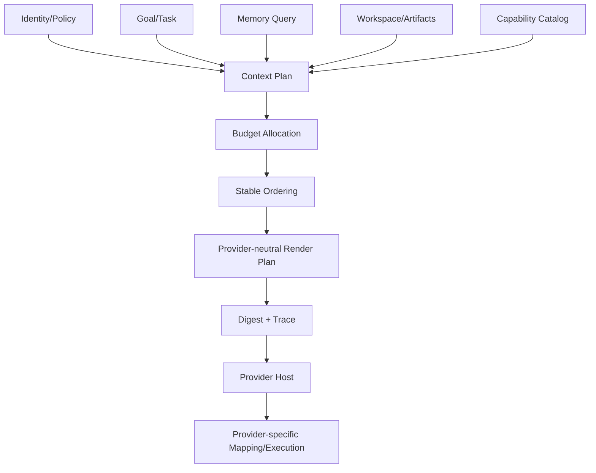

# Brain과 Context 조립

## 1. 목적

Brain을 특정 LLM/Provider가 아닌 Bot의 판단·조정 중심으로 정의하고, 여러 Core가 공유 지식은 일관되게 사용하면서 Working Context는 격리한다. 모델/Tool 선택 정책은 Capability 요구와 선호를 만들되 concrete Provider 선택·호출 권한은 Common Provider Host가 소유한다.

## 2. 책임 범위

- Brain의 논리 책임
- Brain Snapshot과 Working Context
- Capability 요구/선호를 포함한 Model/Tool/Skill routing intent
- Context Plan
- 공유/격리 경계
- Context budget/cache 안정성/재현성

LLM 내부 추론 내용은 저장·모델링 대상이 아니다. Harness 실행과 Provider invocation framework는 각각 `13-harness-integration.md`, `17-extension-framework.md`가 담당한다.

## 3. Brain 구성

Brain은 데이터와 정책의 조합이다.
- Identity revision
- Goal/Task view
- Memory query policy
- Context assembly policy
- Model routing policy
- Tool/Skill capability policy
- Core spawn/delegation policy
- Permission/resource policy references
- response/communication policy
- policy bundle version

Brain은 독립 프로세스나 mutable singleton이 아니다. Bot Coordinator가 command/Execution 준비 시점에 immutable `BrainSnapshot`을 만든다.

## 4. 공유 영역과 격리 영역

| 공유(Bot 수준) | 격리(Core/Execution 수준) |
|---|---|
| BotId, Identity revision | CoreLeaseId, ExecutionId |
| committed Long-term Memory | selected Memory snapshot |
| Goals/global Task projection | current Task slice |
| Permission/Resource policy reference | scoped grants/references |
| Capability catalog snapshot | Provider selection reference |
| Bot-level knowledge | model/tool stream assembly |
| global Task status | scratch artifacts |
| communication policy | cancellation/deadline |

Core는 공유 Memory 객체를 직접 수정하지 않고 Memory Proposal을 제출한다. Core가 Provider Registry나 Lifecycle state를 직접 mutate하지 않는다.

## 5. Context Plan

Context Plan은 model-visible input을 생성하기 전의 구조화된 선택 결과다.
- system identity/persona sections
- active Goal/Task instructions
- runtime/policy snapshot references
- selected Memory IDs/revisions
- prior Execution checkpoint
- required Tool/Skill/Model Capability metadata
- Bot message excerpts
- workspace/Artifact refs
- token/byte budget allocation
- trust/sensitivity labels
- deterministic ordering/truncation
- content digest

Prompt 문자열만 저장하지 않고 source reference와 선택 근거를 보존한다.

## 6. Context 조립 순서

Provider-specific wire rendering은 Provider/Adapter 경계가 담당한다. Brain이 concrete Provider DTO를 생성하지 않는다.

권장 우선순위:
1. 안전/권한/실행 정책
2. Bot Identity와 현재 Task 성공 조건
3. 최신 확정 user instruction/message
4. 필요한 Goal/Memory
5. Tool/Skill schema
6. 과거 상세 trace/보조 정보

## 7. Model / Capability Routing

Brain routing은 concrete Provider implementation을 고르는 authority가 아니다. 다음을 기반으로 **Capability requirement + selection hint/policy input**을 만든다.

- Task 종류/복잡도
- context size
- required Tool/function/streaming feature
- latency/cost budget
- data locality/privacy/trust class
- user/Bot preference
- fallback 허용 여부/quality class

실제 Provider compatibility/health/version/resource/security를 평가해 Provider ID/version/config generation을 선택하는 것은 Provider Host가 Registry/Selector/Policy와 함께 수행한다.

Execution이 시작되면 Host가 확정한 opaque `ProviderSelectionRef`를 Execution snapshot에 pin한다. fallback이 필요하면 동일 Execution을 변이하지 않고 상위 Runtime policy가 새 Attempt를 만든다.

## 8. Core 간 정보 공유

Core 결과는 `Ephemeral Signal | Task Finding | Memory Proposal | Artifact | Bot Message`로 전달한다. Core끼리 상대 mutable scratchpad를 읽지 않는다. Task Finding은 append-only + causal metadata를 사용한다.

## 9. Context Cache와 메모리 효율

- Identity/Policy/Tool schema stable prefix를 revision digest로 cache
- Core별 동일 문자열 대신 immutable shared reference 사용
- Provider-specific serialization cache는 Adapter/Provider-local derived state이며 Common policy/permission revision을 우회하지 않음
- cache key는 model/capability/provider generation/schema/identity/policy revision을 필요한 범위에서 포함
- 동적 Task/Memory와 stable prefix 분리
- token+byte 상한
- 전체 Memory record heap 복제 금지
- hit rate/retained bytes/invalidation cost 계측

Provider-specific cache가 Canonical Context/Memory를 소유하지 않는다.

## 10. 예외상황

- Memory query timeout: policy에 따른 최소 Context degraded 실행 또는 실패
- Context budget 초과: deterministic priority 축약
- conflicting Memory: provenance/confidence/recency + conflict marker
- Tool schema 과다: Task 관련 Capability만 선택
- compatible Provider 없음: Host의 stable `capability-unavailable/provider-not-ready` outcome을 상위 Runtime이 처리
- Provider role/type 미지원: capability metadata negotiation 또는 mapping 실패; concrete branch 금지
- policy revision 폐기: 신규 Execution 차단, 진행 중 보안 강화는 별도 control signal
- stale write proposal: revision conflict
- prompt injection content: untrusted label/instruction-data separation + sensitive action reauthorization

## 11. 확장성

Brain Policy는 versioned bundle로 추가하고 Bot override는 작은 diff로 저장한다. 새로운 모델/Tool은 Capability/Provider Registry에 추가하며 Brain Core를 수정하지 않는다. multi-model verification은 여러 Execution/Core/Capability call 조합으로 구현하고 Brain 복제본을 만들지 않는다.

## 12. 구현 우선순위

- P0: BrainSnapshot, ContextPlan, deterministic assembler, capability routing intent, Reference/Fake model path
- P1: Memory retrieval ranking, prefix cache, explicit fallback policy, Task Finding
- P2: adaptive selection policy input, multi-model verification
- P3: 학습형 policy 최적화

## 13. 검증 기준

- 동일 snapshot/input이 동일 Context Plan digest를 만든다.
- 두 Core의 temporary context가 상대 trace/prompt에 나타나지 않는다.
- 공통 prefix가 불필요하게 복제되지 않는다.
- budget 초과 시 필수 정책/Task가 유지된다.
- Provider 교체가 Brain/Memory 타입 변경을 요구하지 않는다.
- Brain이 concrete Provider type/DTO/Registry mutator에 의존하지 않는다.
- Provider selection/fallback은 Host/Runtime 규칙과 일치한다.
