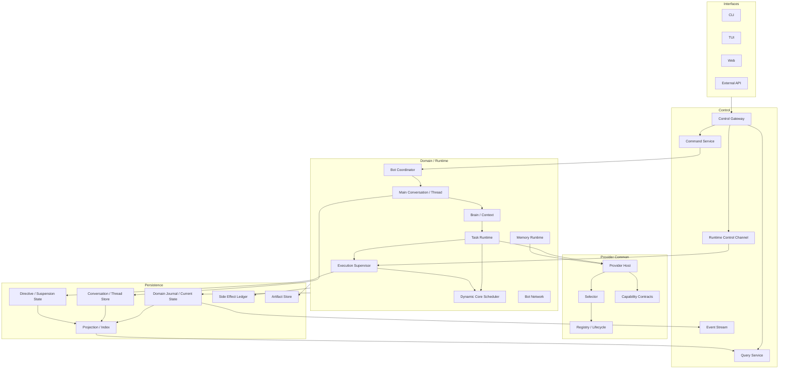

# 전체 시스템 아키텍처

## 1. 목적

DXBOT을 **Persistent Bot → Main Conversation → Thread → Task → Execution → Core Lease**로 이어지는 Memory-Centric Concurrent Runtime으로 정의한다. v0.3의 Common Framework / Stable SPI / Provider Host를 유지하면서 일반 Work Path와 Live Control Path를 명확히 분리한다.

## 2. 목표 구조

```text
Persistent Bot Core Domain
  ├─ Identity / Brain / Bot-global Memory
  ├─ Main Conversation
  ├─ Thread Graph / Thread-local Memory
  ├─ Goal / Task / Task Revision / Execution
  └─ Core Lease / Domain Event / Invariants
        ↓
Application / Runtime Common Framework
  ├─ Command / Unit of Work / Recovery / Side Effect
  ├─ Conversation/Thread Services
  ├─ Task Runtime / Execution Supervisor
  ├─ Dynamic Core Scheduler
  ├─ Runtime Control Channel
  ├─ Capability Contracts
  ├─ Provider Lifecycle / Registry / Selector / Host
  ├─ Permission / Resource / Deadline / Cancellation
  └─ Telemetry / Audit / Config / Testkit
        ↓ Stable SPI
  Providers / Plugins

Interfaces ──> Control API ──┬─ Normal Command/Query Path
                             └─ Live Control Path
```

Interface Session과 Provider Session은 Core Domain owner가 아니다.

## 3. 계층 책임

| 계층 | 책임 | 금지 |
|---|---|---|
| Core Domain | Bot/Conversation/Thread/Memory/Task/Execution 의미와 불변조건 | Provider/UI/DB 구현 참조 |
| Application | Use Case, Unit of Work, auth/idempotency, side-effect orchestration | Domain rule 복제 |
| Conversation/Thread Runtime | message routing, lineage, Thread scope linkage | Memory/Task state machine 직접 소유 |
| Execution Supervisor | live Directive delivery/ack/safe yield orchestration | Execution snapshot mutation |
| Scheduler | Core/Execution admission/fairness/Lease | Provider selection, user fixed core count |
| Provider Host | Provider selection/pin/security/resource/deadline/normalize | Domain/Thread/Task state machine |
| Persistence | Journal/State/Conversation/Thread/Directive/Artifact/Projection | Provider Session을 Canonical truth로 저장 |
| Control | Command/Query/Event/Operation | DB/Core worker 직접 조작 |
| Interface | 표현/상호작용 | Session을 Thread identity로 사용 |

## 4. 논리 흐름



## 5. Normal Work Path

1. Interface가 Main Conversation/Thread message 또는 explicit Task Command를 제출한다.
2. Control/Application이 auth/idempotency/expected revision을 검증한다.
3. Conversation/Thread owner가 message/thread linkage를 Commit한다.
4. Brain이 Thread-aware Context Plan/Task proposal을 만든다.
5. Task Domain이 Task/spec revision을 Commit한다.
6. Scheduler가 provider-independent Core/Execution admission을 수행한다.
7. Provider Host가 필요한 Capability binding을 선택/pin하고 common enforcement를 적용한다.
8. Side Effect면 Intent를 먼저 Commit한다.
9. Provider outcome을 normalize한다.
10. Task/Execution/Memory Proposal/Artifact를 Commit한다.
11. Projection/Event Stream을 갱신한다.

## 6. Live Control Path

1. User/Operator가 Main Conversation/API에서 inspect/report/redirect/suspend/resume/cancel/reprioritize/fork를 요청한다.
2. Gateway가 principal/target scope/expected revision을 검증한다.
3. inspect는 Query path, 상태 변경 control은 durable Command/Directive path를 사용한다.
4. Runtime Control Channel이 일반 Work Queue와 독립적으로 Supervisor에 전달한다.
5. redirect/suspend는 safe point/cooperative yield를 요청한다.
6. old Execution immutable history와 Side Effect state를 보존한다.
7. 필요하면 새 Task Specification revision/new Execution을 Scheduler가 admission한다.
8. acknowledgement/progress/freshness가 Event/API로 노출된다.

Control Channel도 bounded이며 user intent가 Scheduler/Core Lease를 직접 조작하지 않는다.

## 7. Context / Memory Path

```text
Current Input
+ Identity/Policy
+ Current Thread
+ Active Task/Execution
+ Thread-local Memory
+ Relevant Bot-global Memory
+ Recent/Retrieved Thread History
+ Artifacts/Checkpoints
→ bounded Context Plan
→ Provider-neutral Render
→ Provider Host
```

Conversation History와 Memory는 별도 canonical meaning이다. Thread transcript를 전체 prompt로 재생하지 않는다.

## 8. Provider Host / Session Independence

v0.3 Host pipeline을 유지한다: validation → binding selection/pin → permission/resource/deadline/cancel → side-effect guard → telemetry → SPI → normalization/accounting.

Provider Session은 Adapter 내부 resume optimization이다. Thread/Task/Context의 authoritative history가 아니며 Session loss 시 Canonical Context Plan에서 새 call/session을 만들 수 있어야 한다.

## 9. Persistence / Recovery

- Bot/Main Conversation/Thread/lineage/message는 durable
- Thread-local Memory scope와 promotion provenance는 durable
- Task spec revision/Execution snapshot immutable history는 durable
- pending Control Directive/Suspension checkpoint는 durable
- Runtime Control queue 자체는 transient이며 committed Directive에서 재구성 가능
- Provider Session/live handle은 durable authority가 아님
- crash 시 redirect committed 후 old yield/new Execution 사이를 idempotently resume

## 10. Feature Removal / Modularity

Provider/Plugin/Interface 제거는 Conversation/Thread/Task schema 의미를 바꾸지 않는다. Web/TUI 제거로 Main Conversation이 삭제되지 않으며 Provider 제거로 Thread가 새 ID를 받지 않는다.

## 11. 검증 기준

- Domain dependency graph에 Provider/Plugin/UI가 없다.
- Work Queue와 Control Channel이 분리되고 각각 bounded다.
- Provider selection/permit은 Host, Core Lease는 Scheduler가 소유한다.
- Thread A/B/C 병렬 context/control이 격리된다.
- redirect가 old Execution/Provider binding을 mutation하지 않는다.
- Provider Session 손실 후 동일 Thread에서 새 call을 구성한다.
- crash 후 Conversation/Thread/Directive/Suspension/Side Effect 상태가 owner contract로 복구된다.
