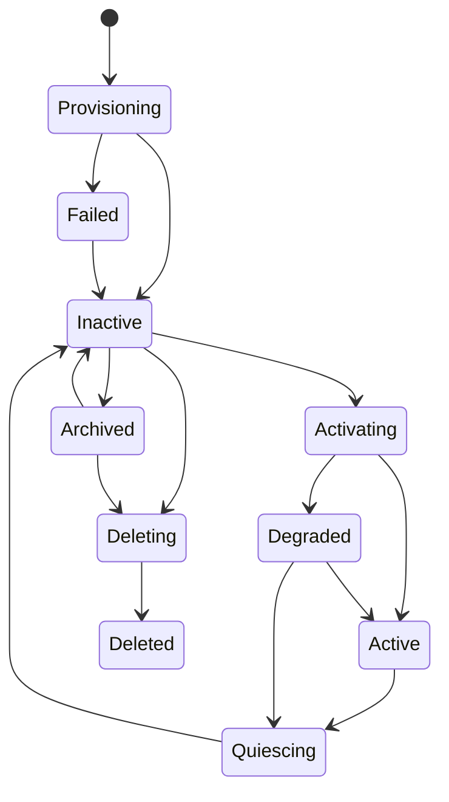

# Bot Identity와 Lifecycle

## 1. 목적

Bot을 Interface Session·프로세스·모델·Harness/Provider Session과 독립적으로 지속시키고, Bot당 하나의 Persistent Main Conversation과 Thread Graph가 Bot lifecycle에 따라 일관되게 복원되도록 한다.

## 2. Bot Aggregate

Canonical 구성:
- BotId
- Identity revision
- lifecycle state
- Brain policy reference
- Bot-global Memory namespace
- Main Conversation identity/reference
- Goal references
- Permission/Resource policy references
- Routine references 또는 owner relation
- workspace/provenance
- aggregate revision

Conversation/Thread의 상세 상태는 `DXB-DOM-027`이 별도 Canonical Owner다. Bot은 Main Conversation이 자신에게 하나만 존재한다는 소유 관계를 가진다.

비Canonical:
- active Core 목록
- Interface Session 목록/browser tab/WebSocket
- Provider runtime/session handle
- cache/index state
- currently loaded Plugin objects

## 3. Lifecycle

`Archived`에서는 신규 Routine trigger와 신규 Task admission을 기본 차단한다. Bot archive가 Conversation/Thread history를 삭제하지 않는다.

## 4. Main Conversation 소유권

- Bot provisioning은 동일 Unit of Work 또는 명시적으로 복구 가능한 bootstrap operation에서 Main Conversation identity를 생성한다.
- Main Conversation은 UI room이 아니라 Bot 소유의 영속 logical surface다.
- Bot restart/activation은 기존 Main Conversation/Thread Graph를 복원하며 새 Conversation을 만들지 않는다.
- 여러 Interface Session이 같은 Main Conversation에 접속할 수 있다.
- 마지막 Session 종료는 Bot/Conversation/Thread lifecycle을 변경하지 않는다.
- Bot delete는 Conversation/Thread/Message/Memory/Artifact retention/forget 정책을 명시적으로 수행한다. Session 삭제와 같은 operation이 아니다.

## 5. Provider/Capability와 Identity 분리

- Bot Identity에 concrete Harness/Model Provider type이나 Provider Session ID를 저장하지 않는다.
- Bot profile은 stable Capability requirement와 optional provider preference/selector policy reference를 가질 수 있다.
- Provider/Provider Session이 제거되어도 Bot Identity/Main Conversation/Thread revision을 migration하지 않는다.
- required capability가 없으면 capability-specific operation에 `Unavailable/Unsupported`를 반환하거나 정책상 Degraded가 될 수 있다.
- Provider 복구가 Bot/Conversation clone 또는 새 Thread 생성을 의미하지 않는다.

## 6. Routine 소유권

Routine은 Bot이 소유하는 영속 자동 실행 정의다.

- `Active`: enabled Routine trigger 허용
- `Degraded`: capability/resource 조건에 따라 queue/skip
- `Quiescing`: 신규 occurrence claim 중지
- `Inactive`: trigger 실행 중지, missed-run은 Routine policy
- `Archived`: 신규 trigger 금지
- `Deleting/Deleted`: Routine disable 후 retention/purge

Routine Task가 특정 Thread에 귀속되어야 하는 경우 Task template 또는 routing policy가 명시적 Thread reference를 생성한다. UI Session을 기준으로 Thread를 선택하지 않는다.

## 7. Activation / Recovery

1. Bot/Identity 복원
2. Main Conversation identity 복원/검증
3. Thread Graph와 Thread-local Memory scope 연결 복원
4. Bot-global Memory namespace 복원
5. enabled Routine 복원 및 occurrence reconcile
6. pending Task/Continuation/Suspension/Directive reconcile
7. Provider capability/lifecycle 재검증
8. Bot Active/Degraded 판정

Provider Session resume 실패는 이 순서를 무효화하지 않는다.

## 8. Identity 변경

Identity는 immutable revision을 추가한다. 진행 중 Execution은 시작 revision을 유지한다. Permission/security restriction 강화는 별도 policy/control signal로 더 빠르게 적용할 수 있으나 Persona/Role/Provider preference 변경은 신규 Execution부터 적용한다.

Identity 변경이 기존 Thread transcript/Memory를 재작성하지 않는다. 필요한 경우 Context Plan이 최신 Identity revision과 historical provenance를 함께 사용한다.

## 9. 비활성화와 Quiescence

- 신규 Task/Routine occurrence admission 중지
- Core/Execution quiesce/cancel/suspend policy 적용
- pending Memory Proposal commit/abort
- Waiting/Suspended Task Continuation 보존
- pending Control Directive acknowledgement/recovery state 보존
- Side Effect Ledger Unknown은 reconciliation 대상으로 보존
- outbox/checkpoint flush
- child process/channel 종료 확인
- coordinator drop

Conversation/Thread history는 quiescence 대상이 아니라 persistent state다.

## 10. Session 독립성

세 의미를 구분한다.

- Interface Session: 임시 client connection
- Provider Session: Provider-private derived optimization
- Thread: DXBOT-owned persistent context boundary

Interface/Provider Session의 생성·종료·손실이 Bot/Main Conversation/Thread를 생성·삭제하지 않는다. 여러 Interface Session의 상충 Command는 expected revision/idempotency/control policy로 직렬화한다.

## 11. 검증 기준

- AT-BOT-001: 마지막 Interface Session 종료가 Bot lifecycle을 변경하지 않는다.
- AT-BOT-003: restart 후 같은 BotId/Identity/Memory namespace가 복원된다.
- AT-CONV-001: restart/disconnect 후 동일 Main Conversation/Thread 목록이 복원된다.
- AT-SESSION-002: Provider Session 손실 후에도 Bot/Conversation/Thread/Memory가 유지된다.
- Provider 제거 후 Identity/Main Conversation migration이 필요하지 않는다.
- deactivate 완료 시 owned Core/process/channel이 0이고 Waiting/Suspended Continuation은 유실되지 않는다.
